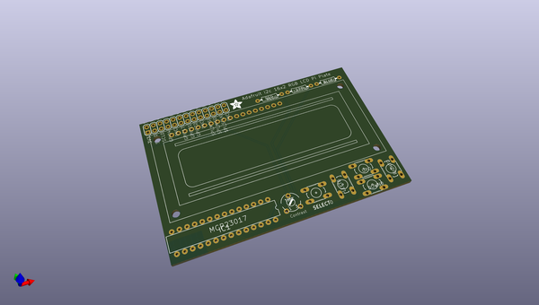
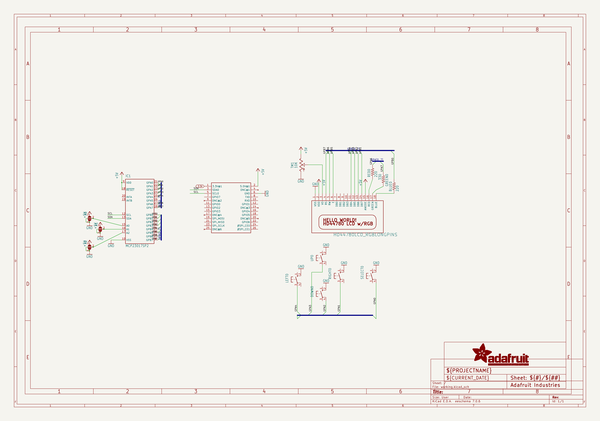
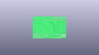
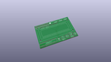
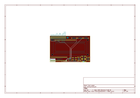
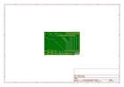
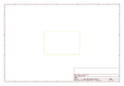
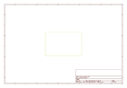
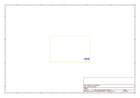
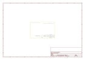

# OOMP Project  
## Adafruit-16x2-LCD-Pi-Plate  by adafruit  
  
(snippet of original readme)  
  
- PCB files for Adafruit 16x2 LCD Pi Plate for Raspberry Pi  
  
<a href="http://www.adafruit.com/products/1110"> Click here to purchase one from the Adafruit shop</a>  
  
* https://www.adafruit.com/product/1110  
* https://www.adafruit.com/product/1115  
* http://www.adafruit.com/products/1109  
  
This new Adafruit Pi Plate makes it easy to use a blue and white 16x2 Character LCD. [We really like the 16x2 Character LCDs we stock in the shop](http://www.adafruit.com/products/181). Unfortunately, these LCDs do require quite a few digital pins, 6 to control the LCD and then another 1 to control the backlight for a total of 7 pins. That's nearly all the GPIO available on a Pi!  
  
With this in mind, we wanted to make it easier for people to get these LCD into their projects so we devised a Pi plate that lets you control __a 16x2 Character LCD, up to 3 backlight pins AND 5 keypad pins using only the two I2C pins on the R-Pi!__ The best part is you don't really lose those two pins either, since you can stick i2c-based sensors, RTCs, etc and have them share the I2C bus. This is a super slick way to add a display without all the wiring hassle.  
  
__New, we've updated this Pi plate so the buttons on on the right side, which makes it a little more mechanically stable__  
  
This pi plate is perfect for when you want to build a stand-alone project with its own user interface. The 4 directional buttons plus select button allows basic control without havin  
  full source readme at [readme_src.md](readme_src.md)  
  
source repo at: [https://github.com/adafruit/Adafruit-16x2-LCD-Pi-Plate](https://github.com/adafruit/Adafruit-16x2-LCD-Pi-Plate)  
## Board  
  
  
## Schematic  
  
  
  
[schematic pdf](working_schematic.pdf)  
## Images  
  
  
  
  
  
  
  
  
  
  
  
  
  
  
  
  
