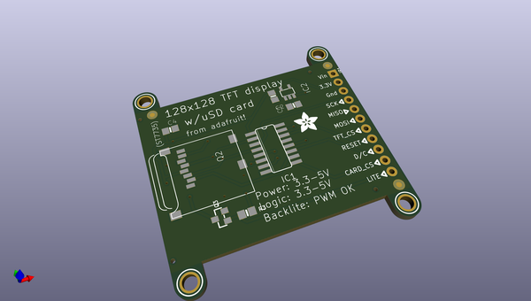

# OOMP Project  
## Adafruit-1.44-TFT-Breakout-PCB  by adafruit  
  
oomp key: oomp_projects_flat_adafruit_adafruit_1_44_tft_breakout_pcb  
(snippet of original readme)  
  
-- Adafruit 1.44" TFT LCD Color Display Breakout PCB  
  
<a href="http://www.adafruit.com/products/2088">   
Click here to purchase one from the Adafruit shop</a>  
  
PCB files for the Adafruit 1.44 TFT Breakout. Format is EagleCAD schematic and board layout  
* https://www.adafruit.com/products/2088  
  
--- Description  
  
This lovely little display breakout is the best way to add a small, colorful and bright display to any project. Since the display uses 4-wire SPI to communicate and has its own pixel-addressable frame buffer, it can be used with every kind of microcontroller. Even a very small one with low memory and few pins available!  
  
The 1.44" display has 128x128 color pixels. Unlike the low cost "Nokia 6110" and similar LCD displays, which are CSTN type and thus have poor color and slow refresh, this display is a true TFT! The TFT driver (ST7735R) can display full 16-bit color using our library code.  
  
The breakout has the TFT display soldered on (it uses a delicate flex-circuit connector) as well as a ultra-low-dropout 3.3V regulator and a 3/5V level shifter so you can use it with 3.3V or 5V power and logic. We also had a little space so we placed a microSD card holder so you can easily load full color bitmaps from a FAT16/FAT32 formatted microSD card. The microSD card is not included.  
  
NEW! As of February 28, 2023 - we've updated this TFT breakout with an EYESPI connector to make cabling easier with an 18-pin FPC. We also used  
  full source readme at [readme_src.md](readme_src.md)  
  
source repo at: [https://github.com/adafruit/Adafruit-1.44-TFT-Breakout-PCB](https://github.com/adafruit/Adafruit-1.44-TFT-Breakout-PCB)  
## Board  
  
  
## Schematic  
  
  
  
[schematic pdf](working_schematic.pdf)  
## Images  
  
  
  
  
  
  
  
  
  
  
  
  
  
  
  
  
