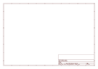

# OOMP Project  
## Adafruit_1.8_Inch_TFT_Breakout_PCB  by adafruit  
  
oomp key: oomp_projects_flat_adafruit_adafruit_1_8_inch_tft_breakout_pcb  
(snippet of original readme)  
  
- 1.8" Color TFT LCD display with MicroSD Card Breakout  
  
<a href="http://www.adafruit.com/products/358"> Click here to purchase one from the Adafruit shop</a>  
  
This lovely little display breakout is the best way to add a small, colorful and bright display to any project. Since the display uses 4-wire SPI to communicate and has its own pixel-addressable frame buffer, it can be used with every kind of microcontroller. Even a very small one with low memory and few pins available!  
  
The 1.8" display has 128x160 color pixels. Unlike the low cost "Nokia 6110" and similar LCD displays, which are CSTN type and thus have poor color and slow refresh, this display is a true TFT! The TFT driver (ST7735R) can display full 18-bit color (262,144 shades!). And the LCD will always come with the same driver chip so there's no worries that your code will not work from one to the other.  
  
The breakout has the TFT display soldered on (it uses a delicate flex-circuit connector) as well as a ultra-low-dropout 3.3V regulator and a 3/5V level shifter so you can use it with 3.3V or 5V power and logic. We also had a little space so we placed a microSD card holder so you can easily load full color bitmaps from a FAT16/FAT32 formatted microSD card. The microSD card is not included, [but you can pick one up here](https://www.adafruit.com/product/102).  
  
Of course, we wouldn't just leave you with a datasheet and a "good luck!" - [we've written a full open  
  full source readme at [readme_src.md](readme_src.md)  
  
source repo at: [https://github.com/adafruit/Adafruit_1.8_Inch_TFT_Breakout_PCB](https://github.com/adafruit/Adafruit_1.8_Inch_TFT_Breakout_PCB)  
## Board  
  
  
## Schematic  
  
  
  
[schematic pdf](working_schematic.pdf)  
## Images  
  
  
  
  
  
  
  
  
  
  
  
  
  
  
  
  
