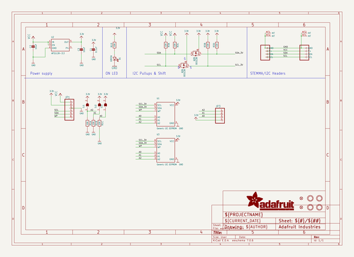

# OOMP Project  
## Adafruit-24LC32-PCB  by adafruit  
  
(snippet of original readme)  
  
-- Adafruit 24LC32 I2C EEPROM Breakout PCB  
  
<a href="http://www.adafruit.com/products/5146">   
Click here to purchase one from the Adafruit shop</a>  
  
PCB files for the Adafruit 24LC32 I2C EEPROM Breakout.   
  
Format is EagleCAD schematic and board layout  
* https://www.adafruit.com/product/5146  
  
--- Description  
  
If you want to store calibration values, MAC addresses, non-secure access tokens, or other unique identifiers, EEPROM storage is a great option. EEPROM is long lasting, and doesn't need to be written in pages - a single byte can be written at once (unlike with flash memory!) EEPROM storage persists even when the power goes out, and can be over-written literally one million times.  
  
Some microcontrollers, like the ATmega328, have built in EEPROM, usually around 64 to 1024 bytes of it. But some, especially ARM Cortex's, don't! What then? that's where this petite Adafruit 24LC32 I2C EEPROM Breakout comes in to help! With 32 Kbit (4 KByte) of storage, and handy chainable Stemma QT connectors, it's just the right amount of simple I2C-controllable storage. Since its external to your microcontroller or microcomputer, uploading new flash memory won't wipe the data from this chip.  
  
We use the CAT24C32 (or equivalent) EEPROM, internally organized as 4096 words of 8 bits each. It features a 32 byte page write buffer (if you want to write faster than one byte at a time). Use 2 to 5V power/logic and up to 1 MHz clocked I2C. The defa  
  full source readme at [readme_src.md](readme_src.md)  
  
source repo at: [https://github.com/adafruit/Adafruit-24LC32-PCB](https://github.com/adafruit/Adafruit-24LC32-PCB)  
## Board  
  
  
## Schematic  
  
  
  
[schematic pdf](working_schematic.pdf)  
## Images  
  
  
  
  
  
  
  
  
  
  
  
  
  
  
  
  
