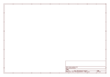
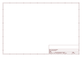

# OOMP Project  
## Adafruit_2.8_Inch_TFT_Shield_PCB  by adafruit  
  
oomp key: oomp_projects_flat_adafruit_adafruit_2_8_inch_tft_shield_pcb  
(snippet of original readme)  
  
- 2.8" TFT Touch Shield for Arduino   
  
  
  
We've discontinued this version of the shield (which was expensive and difficult to make) and [replaced it with a version 2: its got a better price, uses way fewer pins, is Mega/Leonardo compatible and has a great touchscreen controller built in. Wow! Check it out here.](http://www.adafruit.com/products/1651)  
  
Spice up your Arduino project with a beautiful large touchscreen display shield with built in microSD card connection. This TFT display is big (2.8" diagonal) bright (4 white-LED backlight) and colorful (18-bit 262,000 different shades)! 240x320 pixels with individual pixel control. It has way more resolution than a black and white 128x64 display. As a bonus, this display has a resistive touchscreen attached to it already, so you can detect finger presses anywhere on the screen.  
  
__The shield is fully assembled, tested and ready to go. No wiring, no soldering! Simply plug it in and load up our library - you'll have it running in under 10 minutes!__ Works best with any classic Arduino (UNO/Duemilanove/Diecimila). This shield does work with the Mega Arduinos __but its going to be half the speed of the Uno-type boards__ because of the way the Mega rearranges all the pins (there is no way to get around this!) This shield is not Leonardo-compatible  
  
This display shield has a controller built into it with RAM buffering, so that almost n  
  full source readme at [readme_src.md](readme_src.md)  
  
source repo at: [https://github.com/adafruit/Adafruit_2.8_Inch_TFT_Shield_PCB](https://github.com/adafruit/Adafruit_2.8_Inch_TFT_Shield_PCB)  
## Board  
  
  
## Schematic  
  
  
  
[schematic pdf](working_schematic.pdf)  
## Images  
  
  
  
  
  
  
  
  
  
  
  
  
  
  
  
  
