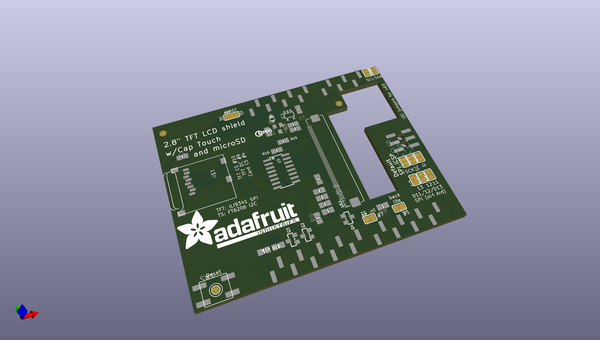
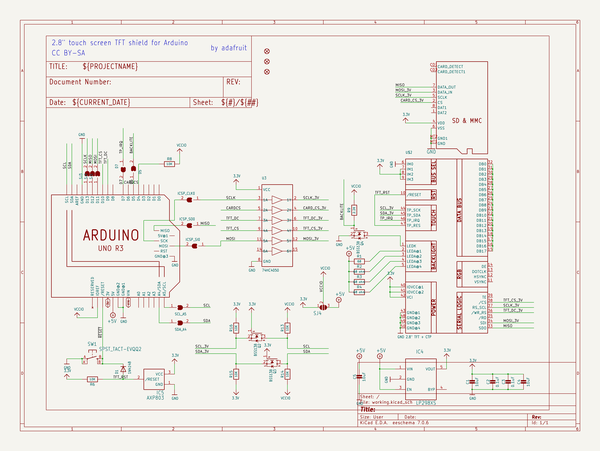
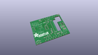
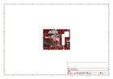
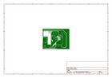
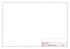
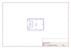
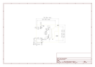

# OOMP Project  
## Adafruit-2.8-TFT-Shield-v2-PCB  by adafruit  
  
(snippet of original readme)  
  
- Adafruit 2.8 TFT LCD Display Shield v2 PCBs  
&nbsp;   
   
Click to view/purchase from the Adafruit Shop:  
- [2.8" TFT Touch Shield for Arduino with Resistive Touch Screen](https://www.adafruit.com/product/1651)  
- [2.8" TFT Touch Shield for Arduino w/Capacitive Touch](https://www.adafruit.com/product/1947)  
  
Spice up your Arduino project with a beautiful large touchscreen display shield with built in microSD card connection. This TFT display is big (2.8" diagonal) bright (4 white-LED backlight) and colorful (18-bit 262,000 different shades)! 240x320 pixels with individual pixel control. It has way more resolution than a black and white 128x64 display. As a bonus, these displays has a resistive or capacitive touchscreen attached to it already, so you can detect finger presses anywhere on the screen.   
  
We've updated our original v1 shield to an SPI display - its a tiny bit slower but uses a lot less pins and is now much easier to use with Mega & Leonardo. We also include an SPI touchscreen controller so you only need one additional pin to add a high quality touchscreen controller. Even with all the extras, the price is lower thanks to our parts sourcing & engineering skillz!  
  
This is the PCB for the two Adafruit 2.8" TFT Shields v2 Resistive and Capacitive touch screens.   
  
The   
  full source readme at [readme_src.md](readme_src.md)  
  
source repo at: [https://github.com/adafruit/Adafruit-2.8-TFT-Shield-v2-PCB](https://github.com/adafruit/Adafruit-2.8-TFT-Shield-v2-PCB)  
## Board  
  
  
## Schematic  
  
  
  
[schematic pdf](working_schematic.pdf)  
## Images  
  
  
  
  
  
  
  
  
  
  
  
  
  
  
  
  
