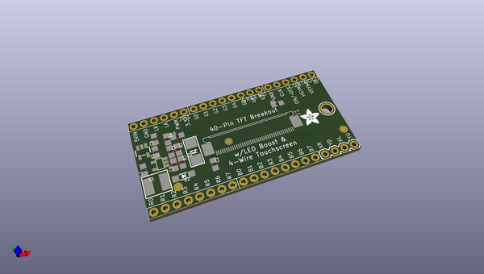
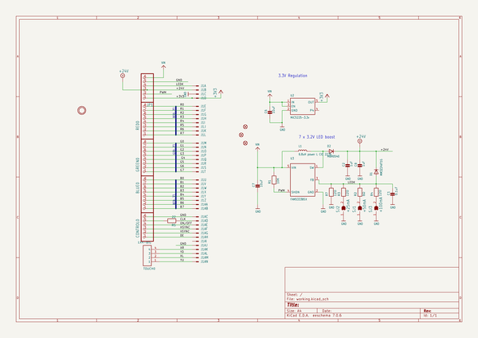
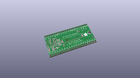
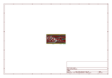
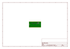
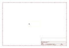
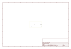
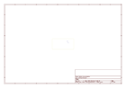
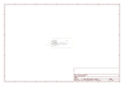

# OOMP Project  
## Adafruit-40-pin-TFT-Friend  by adafruit  
  
(snippet of original readme)  
  
-- Adafruit-40-pin-TFT-Friend  
  
<a href="http://www.adafruit.com/products/1932">   
Click here to purchase one from the Adafruit shop</a>  
  
These are the Eagle CAD files for the Adafruit 40-pin TFT Friend / Breakout Board  
- https://www.adafruit.com/product/1932  
  
This breakout board is something we designed in-house to help us work with 'dot-clock' 40-pin TFT displays that require the RGB pixel data to be clocked in continuously. These displays have 40-pin Flex PCB (FPC) cables and often require a boost converter for the backlight LED, which makes them annoying to breadboard. To make them breadboardable, we stuck a 40-pin FPC and a FAN5333-based backlight driver with adjustable current onto a labeled breakout board. Now you can poke and probe each pin!  
  
The backlight driver defaults to 25mA and can boost up to 24VDC for up to 7-LED strings. Check your display datasheet for the string configuration, and short out the jumpers to increase the backlight current.   
  
--- License  
  
Adafruit invests time and resources providing this open source design, please support Adafruit and open-source hardware by purchasing products from [Adafruit.com](https://www.adafruit.com)!  
  
Creative Commons Attribution, Share-Alike license, check license.txt for more information All text above must be included in any redistribution -   
See license.txt for more information.  
  
  full source readme at [readme_src.md](readme_src.md)  
  
source repo at: [https://github.com/adafruit/Adafruit-40-pin-TFT-Friend](https://github.com/adafruit/Adafruit-40-pin-TFT-Friend)  
## Board  
  
  
## Schematic  
  
  
  
[schematic pdf](working_schematic.pdf)  
## Images  
  
  
  
  
  
  
  
  
  
  
  
  
  
  
  
  
