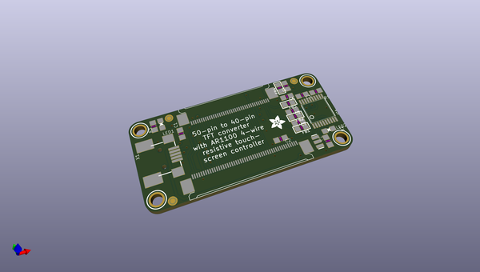
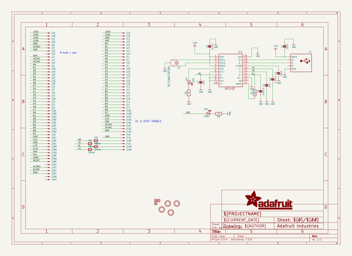
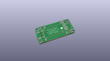
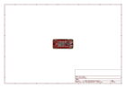
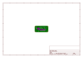
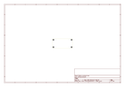
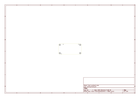
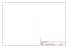
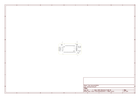

# OOMP Project  
## Adafruit-50pin-to-40pin-TFT-with-AR1100-Adapter-PCB  by adafruit  
  
oomp key: oomp_projects_flat_adafruit_adafruit_50pin_to_40pin_tft_with_ar1100_adapter_pcb  
(snippet of original readme)  
  
-- Adafruit 50pin to 40pin TFT with AR1100 Adapter PCB  
<a href="http://www.adafruit.com/products/3305">   
Click here to purchase one from the Adafruit shop  
</a>  
  
PCB files for the Adafruit 50pin to 40pin TFT with AR1100 Adapter  
- https://www.adafruit.com/product/3305  
  
Format is EagleCAD schematic and board layout  
  
This is a very special adapter, specifically used for adapting our RTD266X driver boards that have 50-pin TFT connectors to use 40-pin TFTs. Please note the adapter cannot be used the other way around! As an addition, we add in an AR1100 resistive touch controller.  
  
Resistive touch screens are incredibly popular as overlays to TFT and LCD displays. If you want to connect one to a computer you need something to handle the analog to digital conversion. Most converters we've found are not very easy to use, and are 'fixed' - making them difficult to calibrate. The AR1100 is a nice chip that solves this problem by acting as a touch->USB converter and also comes with calibration software. The calibration software is Windows only, but once you've calibrated you can use the screen on any OS. The AR1100 shows up as a regular Mouse or Digitizer HID device so no drivers are required and it works on any operating system that supports a USB mouse.  
  
These are sold with our test calibration, you may need to calibrate yourself which you can do with the Microchip windows software. For more details including calibration software,   
  full source readme at [readme_src.md](readme_src.md)  
  
source repo at: [https://github.com/adafruit/Adafruit-50pin-to-40pin-TFT-with-AR1100-Adapter-PCB](https://github.com/adafruit/Adafruit-50pin-to-40pin-TFT-with-AR1100-Adapter-PCB)  
## Board  
  
  
## Schematic  
  
  
  
[schematic pdf](working_schematic.pdf)  
## Images  
  
  
  
  
  
  
  
  
  
  
  
  
  
  
  
  
