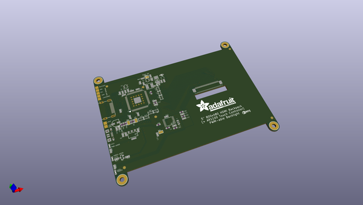
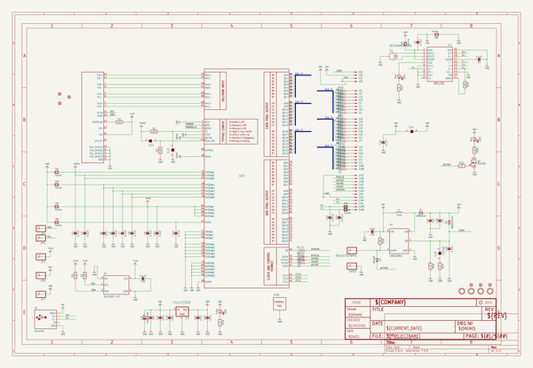
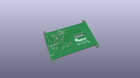
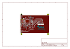
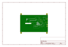
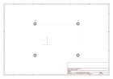
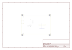
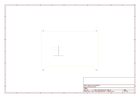
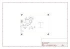

# OOMP Project  
## Adafruit-5-HDMI-Backpack-PCB  by adafruit  
  
(snippet of original readme)  
  
-- Adafruit 5" HDMI Backpack PCB  
&nbsp;    
Click to purchase from the Adafruit Shop:  
- [HDMI 5" 800x480 Display Backpack - With Resistive Touchscreen](https://www.adafruit.com/product/2260)  
- [HDMI 5" Display Backpack - Without Touch](https://www.adafruit.com/product/2232)  
  
Its a mini panel-mountable HDMI monitor with a built-in resistive touchscreen! So small and simple, you can use this display with any computer that has HDMI output, and the shape makes it easy to attach to a case or rail. This backpack features the TFP401 for decoding video, and includes the attached display so its plug-n-play.  
  
The TFP401 is a beefy DVI/HDMI decoder from TI. It can take unencrypted video and pipe out the raw 24-bit color pixel data - HDCP not supported! The 5" display is 800x480 resolution, which is just enough to run most software, but still small enough that it can be used in portable or embedded projects without the bulk.  
  
This is the PCB for the Adafruit 5" TFT HDMI backpacks. The format is EagleCAD schematic and board layout  
  
For more details, check out the product pages at  
- https://www.adafruit.com/product/2260  
- https://www.adafruit.com/product/2232  
  
--- License  
  
Adafruit invests time and resources providing this open source design, please support Adafruit and open-source hard  
  full source readme at [readme_src.md](readme_src.md)  
  
source repo at: [https://github.com/adafruit/Adafruit-5-HDMI-Backpack-PCB](https://github.com/adafruit/Adafruit-5-HDMI-Backpack-PCB)  
## Board  
  
  
## Schematic  
  
  
  
[schematic pdf](working_schematic.pdf)  
## Images  
  
  
  
  
  
  
  
  
  
  
  
  
  
  
  
  
