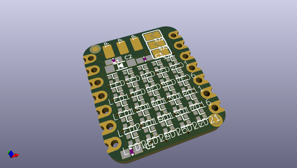
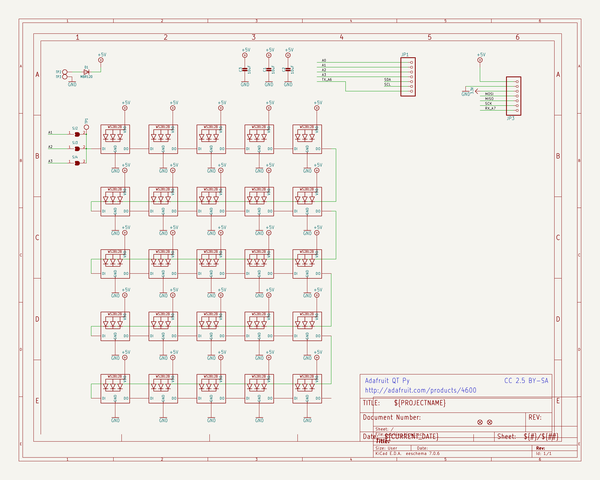
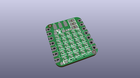
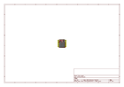
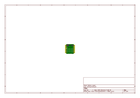
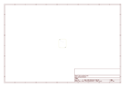
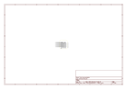

# OOMP Project  
## Adafruit-5x5-NeoPixel-Grid-BFF-PCB  by adafruit  
  
(snippet of original readme)  
  
-- Adafruit 5x5 NeoPixel Grid BFF PCB  
  
<a href="http://www.adafruit.com/products/5646">   
Click here to purchase one from the Adafruit shop</a>  
  
PCB files for the Adafruit 5x5 NeoPixel Grid BFF.   
  
Format is EagleCAD schematic and board layout  
* https://www.adafruit.com/product/5646  
  
--- Description  
  
Our QT Py boards are a great way to make very small microcontroller projects that pack a ton of power - and now we have a way for you to quickly add a glittering grid of 25 RGB addressable micro NeoPixels. It's an excellent way to make tiny wearable, cosplay, or IoT projects with dazzling LEDs.  
  
We call this the Adafruit 5x5 NeoPixel Grid BFF - a "Best Friend Forever". When you were a kid you may have learned about the "buddy" system, well this product is kinda like that! A board that will watch your QT Py's back and act like a technicolor raincoat.  
  
This PCB is designed to fit onto the back of any QT Py or Xiao board, it can be soldered into place or use pin and socket headers to make it removable. Onboard is a grid of 25 1.5x1.5mm NeoPixel LEDs (SK6805 to be exact), connected to pin A3 by default. You can cut/solder some jumpers to select A1, or A2 instead if you like. There's also solder pads for 5V, GND and IN data, in case you want to power externally. Advanced solderer's can use a thin wire to connect from the IN pad to other GPIO pins if desired.  
  
We include some header that you can solder to your QT Py. You can also p  
  full source readme at [readme_src.md](readme_src.md)  
  
source repo at: [https://github.com/adafruit/Adafruit-5x5-NeoPixel-Grid-BFF-PCB](https://github.com/adafruit/Adafruit-5x5-NeoPixel-Grid-BFF-PCB)  
## Board  
  
  
## Schematic  
  
  
  
[schematic pdf](working_schematic.pdf)  
## Images  
  
  
  
  
  
  
  
  
  
  
  
  
  
  
  
  
