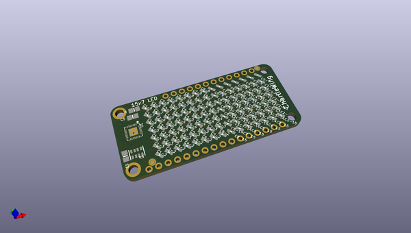
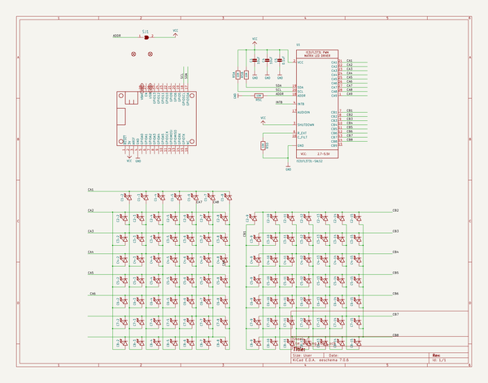
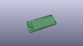
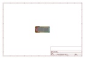
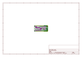
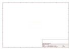
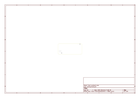
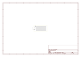

# OOMP Project  
## Adafruit-7x15-CharliePlex-LED-FeatherWing  by adafruit  
  
oomp key: oomp_projects_flat_adafruit_adafruit_7x15_charlieplex_led_featherwing  
(snippet of original readme)  
  
-- Adafruit 7x15 CharliePlex LED FeatherWings PCB  
<a href="http://www.adafruit.com/products/3134">   
Click here to purchase one from the Adafruit shop</a>  
  
You wont be able to look away from the mesmerizing patterns created by this Adafruit 15x7 CharliePlex LED Matrix Display FeatherWing.  This 15x7 LED display can be paired with any of our Feather boards for a beautiful, bright grid of 105 charlieplexed LEDs. It even comes with a built-in charlieplex driver that is run over I2C.  
  
We carry these FeatherWings in five vivid colors!  
  
What is particularly nice about this Wing is the I2C LED driver chip has the ability to PWM each individual LED in a 15x7 grid so you can have beautiful LED lighting effects, without a lot of pin twiddling. Simply tell the chip which LED on the grid you want lit, and what brightness and it's all taken care of for you. You get 8-bit (256 level) dimming for each individual LED.  
  
PCB files for 7x15 CharliePlex LED FeatherWings. The format is EagleCAD schematic and board layout  
  
For more details, check out the product pages at  
  
   * https://www.adafruit.com/product/3134  
   * https://www.adafruit.com/product/3135  
   * https://www.adafruit.com/product/3136  
   * https://www.adafruit.com/product/3137  
   * https://www.adafruit.com/product/3138  
  
--- License  
  
Adafruit invests time and resources providing this open source design, please support Adafruit and open-source hardware by purchasing products from [A  
  full source readme at [readme_src.md](readme_src.md)  
  
source repo at: [https://github.com/adafruit/Adafruit-7x15-CharliePlex-LED-FeatherWing](https://github.com/adafruit/Adafruit-7x15-CharliePlex-LED-FeatherWing)  
## Board  
  
  
## Schematic  
  
  
  
[schematic pdf](working_schematic.pdf)  
## Images  
  
  
  
  
  
  
  
  
  
  
  
  
  
  
  
  
