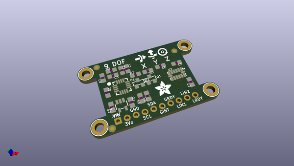
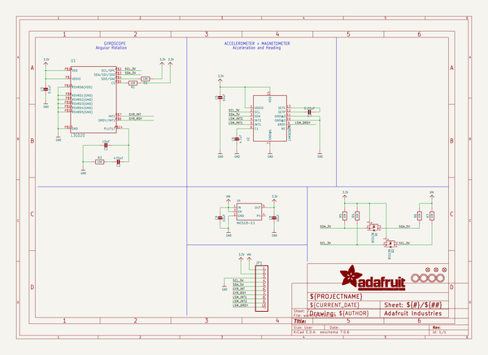
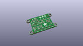
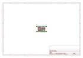
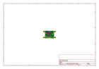
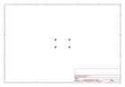
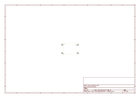
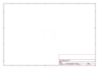
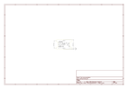

# OOMP Project  
## Adafruit-9-DOF-and-10-DOF-PCBs  by adafruit  
  
(snippet of original readme)  
  
- PCB for the Adafruit 9-DOF and 10-DOF Breakout boards  
  
  
  
__Format is EagleCAD schematic and board layout__  
  
  
* [Adafruit 9-DOF IMU Breakout - L3GD20H + LSM303](https://www.adafruit.com/product/1714)  
* [Adafruit 10-DOF IMU Breakout - L3GD20H + LSM303 + BMP180](https://www.adafruit.com/product/1604)  
  
This inertial-measurement-unit combines 2 of the best quality sensors available on the market to give you 9 axes of data: 3 axes of accelerometer data, 3 axes gyroscopic, and 3 axes magnetic (compass). We tested many different 'combination' sensors and found these were the best value, with stable and reliable readings.  
  
The L3DG20H gyroscope + LSM303DLHC accelerometer/compass sensors are all on one breakout here, to save you space and money. Since all of them use I2C, you can communicate with all of them using only two wires. Most customers will be pretty happy with just the plain I2C interfacing, but we also break out the 'data ready' and 'interrupt' pins, so advanced users can interface with if they choose. A 3V regulator with reverse-polarity protection means you don't have to worry about frying the boards by accident. There's level shifting circuitry so the IMU can be used with 3 or 5V logic boards. And check out those mounting holes! You can securely attach this board to your rocket, robot, art project.  
  
Each order comes with one assembled and tested 9DOF breakout board and   
  full source readme at [readme_src.md](readme_src.md)  
  
source repo at: [https://github.com/adafruit/Adafruit-9-DOF-and-10-DOF-PCBs](https://github.com/adafruit/Adafruit-9-DOF-and-10-DOF-PCBs)  
## Board  
  
  
## Schematic  
  
  
  
[schematic pdf](working_schematic.pdf)  
## Images  
  
  
  
  
  
  
  
  
  
  
  
  
  
  
  
  
