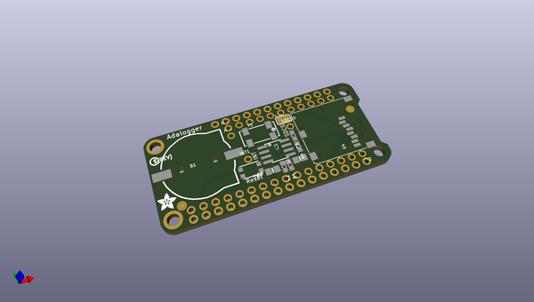
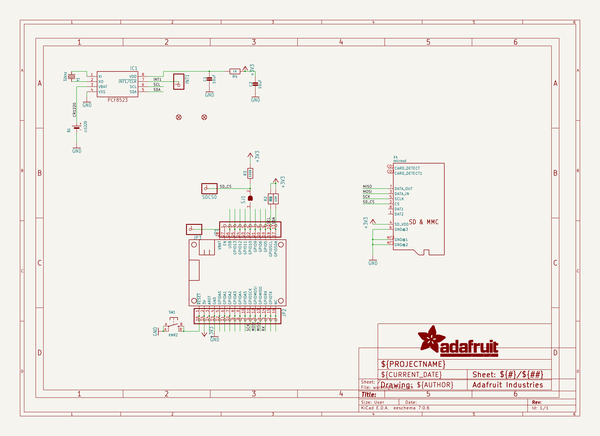
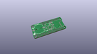
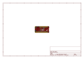
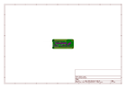
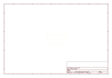
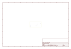
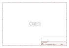
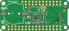

# OOMP Project  
## Adafruit-Adalogger-FeatherWing-PCB  by adafruit  
  
(snippet of original readme)  
  
-- Adafruit FeatherWing - RTC + SD Add-on For All Feather Boards PCB  
  
<a href="http://www.adafruit.com/products/2922">   
Click here to purchase one from the Adafruit shop</a>  
  
PCB files for the Adafruit FeatherWing - RTC + SD Add-on For All Feather Boards. Format is EagleCAD schematic and board layout  
* https://www.adafruit.com/product/2922  
  
--- Description  
  
A Feather board without ambition is a Feather board without FeatherWings! This is the **Adalogger FeatherWing**: it adds both a battery-backed Real Time Clock and micro SD card storage to any Feather main board. Using our [Feather Stacking Headers](https://www.adafruit.com/products/2830) or [Feather Female Headers](http://www.adafruit.com/products/2886) you can connect a FeatherWing on top of your Feather board and let the board take flight!  
  
[Check out our range of Feather boards here.](https://www.adafruit.com/feather)  
  
This FeatherWing will make it real easy to add datalogging to any of our existing Feathers. You get both an I2C real time clock (PCF8523) with 32KHz crystal and battery backup, and a microSD socket that connects to the SPI port pins (+ extra pin for CS). **Tested and works great with all of our Feathers.**  
  
**Does not come with a micro SD card. A CR1220 coin cell is required to use the RTC battery-backup capabilities!** We don't include one by default, to make shipping easier for those abroad, [but we do stock them so pick one up or use any CR1220 you   
  full source readme at [readme_src.md](readme_src.md)  
  
source repo at: [https://github.com/adafruit/Adafruit-Adalogger-FeatherWing-PCB](https://github.com/adafruit/Adafruit-Adalogger-FeatherWing-PCB)  
## Board  
  
  
## Schematic  
  
  
  
[schematic pdf](working_schematic.pdf)  
## Images  
  
  
  
  
  
  
  
  
  
  
  
  
  
  
  
  
  
  
