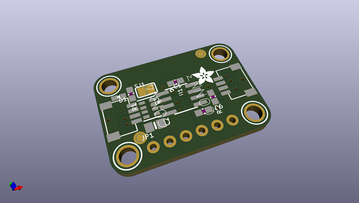
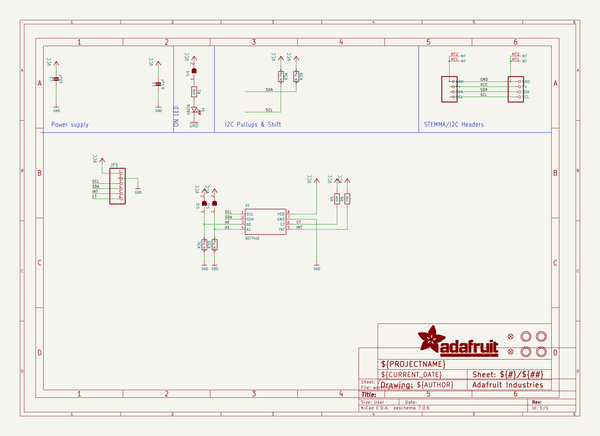
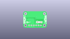
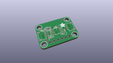
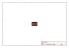
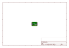
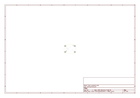
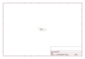

# OOMP Project  
## Adafruit-ADT7410-PCB  by adafruit  
  
(snippet of original readme)  
  
-- Adafruit ADT7410 High Accuracy I2C Temperature Sensor Breakout Board PCB  
  
<a href="http://www.adafruit.com/products/4089">   
Click here to purchase one from the Adafruit shop</a>  
  
PCB files for the Adafruit ADT7410 High Accuracy I2C Temperature Sensor Breakout Board. Format is EagleCAD schematic and board layout  
* https://www.adafruit.com/product/4089  
  
--- Description  
  
Analog Devices, known for their reliable and well-documented sensor chips - has a high precision and high resolution temperature sensor on the market, and we've got a breakout to make it easy to use! The Analog Devices ADT7410 gets straight to the point - it's an I2C temperature sensor, with 16-bit 0.0078°C temperature resolution and 0.5°C temperature tolerance. Wire it up to your microcontroller or single-board computer to get reliable temperature readings with ease  
  
The ADT7410 has 2 address pins, so you can have up to 4 sensors on one I2C bus. There's also interrupt and critical-temperature alert pins. The sensor is good from 2.7V to 5.5V power and logic, for easy integration.  
  
We've got both [Arduino (C/C++)](https://learn.adafruit.com/adt7410-breakout/arduino) and [CircuitPython (Python 3)](https://learn.adafruit.com/adt7410-breakout/python-and-circuitpython) libraries available so you can [use it with any microcontroller like Arduino](https://learn.adafruit.com/adt7410-breakout/arduino), ESP8266, Metro, etc or with [Raspberry Pi or other Linux com  
  full source readme at [readme_src.md](readme_src.md)  
  
source repo at: [https://github.com/adafruit/Adafruit-ADT7410-PCB](https://github.com/adafruit/Adafruit-ADT7410-PCB)  
## Board  
  
  
## Schematic  
  
  
  
[schematic pdf](working_schematic.pdf)  
## Images  
  
  
  
  
  
  
  
  
  
  
  
  
  
  
  
  
