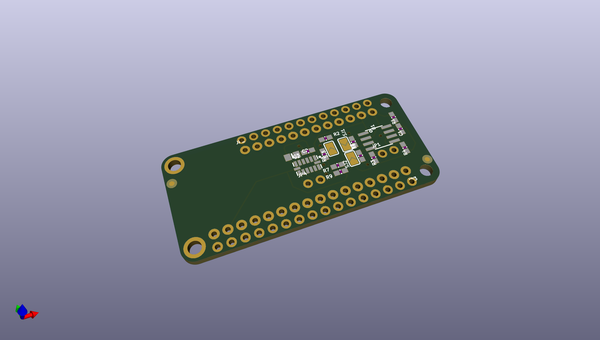
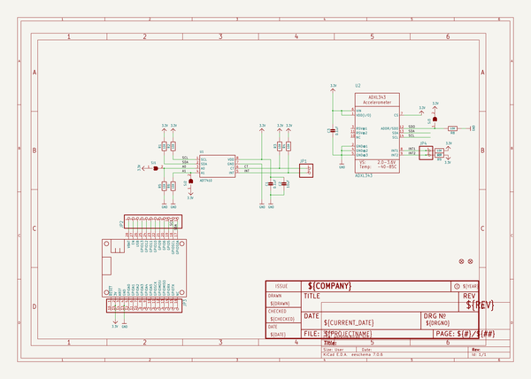
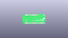
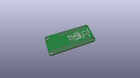
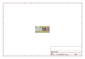
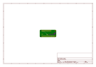
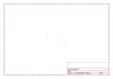
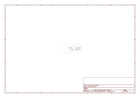

# OOMP Project  
## Adafruit-ADXL343-ADT7410-Featherwing-PCB  by adafruit  
  
oomp key: oomp_projects_flat_adafruit_adafruit_adxl343_adt7410_featherwing_pcb  
(snippet of original readme)  
  
- Adafruit-ADXL353-ADT7410-Featherwing-PCB  
  full source readme at [readme_src.md](readme_src.md)  
  
source repo at: [https://github.com/adafruit/Adafruit-ADXL343-ADT7410-Featherwing-PCB](https://github.com/adafruit/Adafruit-ADXL343-ADT7410-Featherwing-PCB)  
## Board  
  
  
## Schematic  
  
  
  
[schematic pdf](working_schematic.pdf)  
## Images  
  
  
  
  
  
  
  
  
  
  
  
  
  
  
  
  
