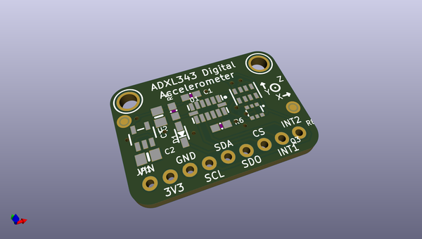
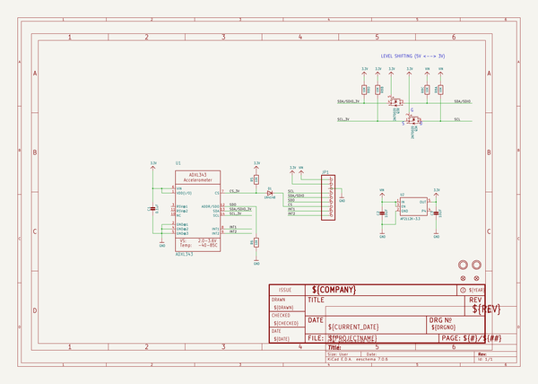

# OOMP Project  
## Adafruit_ADXL343_PCB  by adafruit  
  
oomp key: oomp_projects_flat_adafruit_adafruit_adxl343_pcb  
(snippet of original readme)  
  
-- Adafruit ADXL343 - Triple-Axis Accelerometer (+-2g/4g/8g/16g) w/ I2C/SPI PCB  
  
<a href="http://www.adafruit.com/products/4097">   
<a href="http://www.adafruit.com/products/4097">   
Click here to purchase one from the Adafruit shop</a>  
  
PCB files for the Adafruit ADXL343 - Triple-Axis Accelerometer (+-2g/4g/8g/16g) w/ I2C/SPI. Format is EagleCAD schematic and board layout  
* https://www.adafruit.com/product/4097  
  
--- Description  
  
Analog Devices has followed up on their popular classic, the ADXL345, with this near-drop-in-replacement, the ADXL343. Like the original, this is a triple-axis accelerometer with digital I2C and SPI interface breakout. It has a wide sensitivity range and high resolution, operating with an 10 or 13-bit internal ADC. Built-in motion detection features make tap, double-tap, activity, inactivity, and free-fall detection trivial. There's two interrupt pins, and you can map any of the interrupts independently to either of them.  
  
The ADXL343 is nearly identical in specifications to the ADXL345, and code written for the '345 will likely work on the '343 as-is. This new accelerometer has some nice price improvements to stay within your budget.  
  
The sensor has three axes of measurements, X Y Z, and pins that can be used either as I2C or SPI digital interfacing. You can set the sensitivity level to either +-2g, +-4g, +-8g or +-16g. The lower range gives   
  full source readme at [readme_src.md](readme_src.md)  
  
source repo at: [https://github.com/adafruit/Adafruit_ADXL343_PCB](https://github.com/adafruit/Adafruit_ADXL343_PCB)  
## Board  
  
  
## Schematic  
  
  
  
[schematic pdf](working_schematic.pdf)  
## Images  
  
  
  
  
  
  
  
  
  
  
  
  
  
  
  
  
