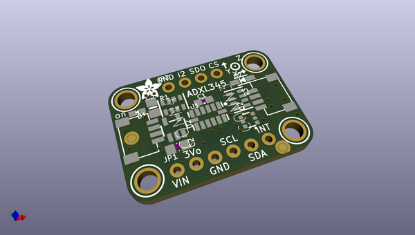
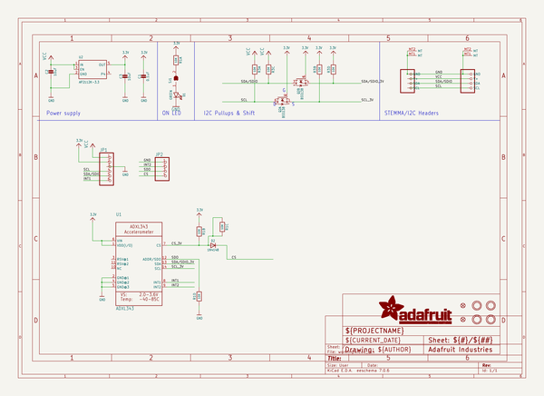
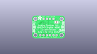
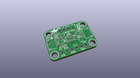
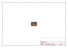
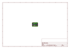
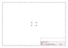
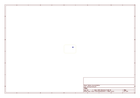
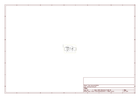

# OOMP Project  
## Adafruit_ADXL345_PCB  by adafruit  
  
(snippet of original readme)  
  
- PCB for the Adafruit 5V ready ADXL345 Digital Triple-Axis Acceleromter (I2C or SPI)  
  
<a href="http://www.adafruit.com/products/1231">   
<a href="http://www.adafruit.com/products/1231">   
Click here to purchase one from the Adafruit shop</a>  
  
__Format is EagleCAD schematic and board layout__  
  
Filling out our accelerometer offerings, we now have the really lovely digital ADXL345 from Analog Devices, a triple-axis accelerometer with digital I2C and SPI interface breakout. We added an on-board 3.3V regulator and logic-level shifting circuitry, making it a perfect choice for interfacing with any 3V or 5V microcontroller such as the Arduino.  
  
The sensor has three axes of measurements, X Y Z, and pins that can be used either as I2C or SPI digital interfacing. You can set the sensitivity level to either +-2g, +-4g, +-8g or +-16g. The lower range gives more resolution for slow movements, the higher range is good for high speed tracking. The ADXL345 is the latest and greatest from Analog Devices, known for their exceptional quality MEMS devices. The VCC takes up to 5V in and regulates it to 3.3V with an output pin.  
  
Fully assembled and tested. Comes with 9 pin 0.1" standard header in case you want to use it with a breadboard or perfboard. Two 2.5mm (0.1") mounting holes for easy attachment.  
  
[Get started in a jiffy with our detailed tutorial!](https://learn.adafruit.com/adxl  
  full source readme at [readme_src.md](readme_src.md)  
  
source repo at: [https://github.com/adafruit/Adafruit_ADXL345_PCB](https://github.com/adafruit/Adafruit_ADXL345_PCB)  
## Board  
  
  
## Schematic  
  
  
  
[schematic pdf](working_schematic.pdf)  
## Images  
  
  
  
  
  
  
  
  
  
  
  
  
  
  
  
  
