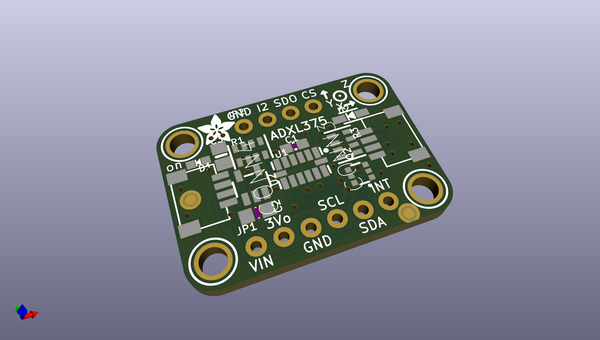
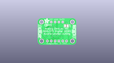
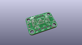
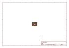
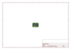
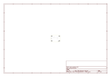
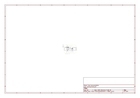

# OOMP Project  
## Adafruit_ADXL375_PCB  by adafruit  
  
(snippet of original readme)  
  
-- Adafruit ADXL375 - High G Accelerometer (+-200g) PCB  
  
<a href="http://www.adafruit.com/products/5374">   
Click here to purchase one from the Adafruit shop</a>  
  
PCB files for the Adafruit ADXL375 - High G Accelerometer (+-200g).   
  
Format is EagleCAD schematic and board layout  
* https://www.adafruit.com/product/5374  
  
--- Description  
  
Hey rocket man (burnin' out your fuse out there alone) ever wonder how fast you're rocketing? The Adafruit ADXL375 High G Accelerometer is an epic +-200g 3-axis accelerometer may be able to tell the answer.  
  
You read that right, this accelerometer can sense up to 200 g's of force in three axes of measurements (X Y Z) has and pins that can be used either as I2C or SPI digital interfacing. for easy integration into any fast project. Built-in motion detection features make shock detection easy to implement. There's two interrupt pins, and you can map any of the interrupts independently to either of them. Incredible! Not surprisingly, we couldn't say "no" to a breakout for this sensor.  
  
The ADXL375 looks and acts nearly identically to its in specifications to the little sisters ADXL345 and ADXL343. Those are only +-16g max, and have adjustable ranges. This sensor acts and looks the same except that you cannot change the range, and it's fixed at 200g. Otherwise, existing library code will 'just work' so if you happen to be using something other than Arduino or CircuitPython, the port is pretty easy  
  full source readme at [readme_src.md](readme_src.md)  
  
source repo at: [https://github.com/adafruit/Adafruit_ADXL375_PCB](https://github.com/adafruit/Adafruit_ADXL375_PCB)  
## Board  
  
  
## Schematic  
  
  
  
[schematic pdf](working_schematic.pdf)  
## Images  
  
  
  
  
  
  
  
  
  
  
  
  
  
  
  
  
