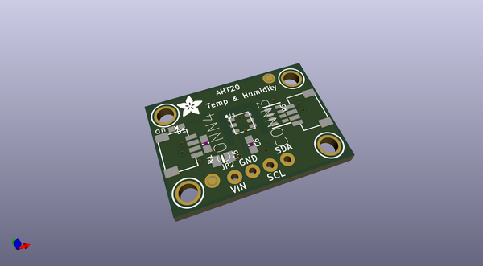
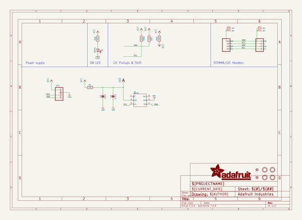
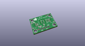
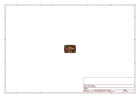
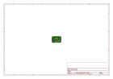
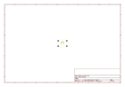
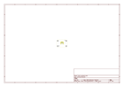
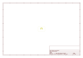

# OOMP Project  
## Adafruit-AHT20-PCB  by adafruit  
  
(snippet of original readme)  
  
-- Adafruit AHT20 Temperature and Humidity Sensor PCB  
  
<a href="http://www.adafruit.com/products/4566">   
Click here to purchase one from the Adafruit shop</a>  
  
PCB files for the Adafruit AHT20 Temperature and Humidity Sensor.  
  
Format is EagleCAD schematic and board layout  
* https://www.adafruit.com/product/4566  
  
--- Description  
  
The AHT20 is a nice but inexpensive temperature and humidity sensor from the same folks that brought us the DHT22. You can take sensor readings as often as you like, and it uses standard I2C so its super easy to use with any Arduino or Linux/Raspberry Pi board.  
  
This sensor has a typical accuracy of +- 2% relative humidity, and +-0.3 °C. There is only one I2C address so its not a good option when you need multiple humidity sensors.  
  
As with all Adafruit breakouts, we've done the work to make this handy temperature-and-humidity super easy to use. We've put it on a breakout board with the required support circuitry and connectors to make it easy to work with and is now a trend we've added SparkFun Qwiic compatible STEMMA QT JST SH connectors that allow you to get going without needing to solder. Just use a STEMMA QT adapter cable, plug it into your favorite microcontroller or Blinka supported SBC and you're ready to rock!  
  
--- License  
  
Adafruit invests time and resources providing this open source design, please support Adafruit and open-source hardware by purchasing products from [Adafruit](https://  
  full source readme at [readme_src.md](readme_src.md)  
  
source repo at: [https://github.com/adafruit/Adafruit-AHT20-PCB](https://github.com/adafruit/Adafruit-AHT20-PCB)  
## Board  
  
  
## Schematic  
  
  
  
[schematic pdf](working_schematic.pdf)  
## Images  
  
  
  
  
  
  
  
  
  
  
  
  
  
  
  
  
