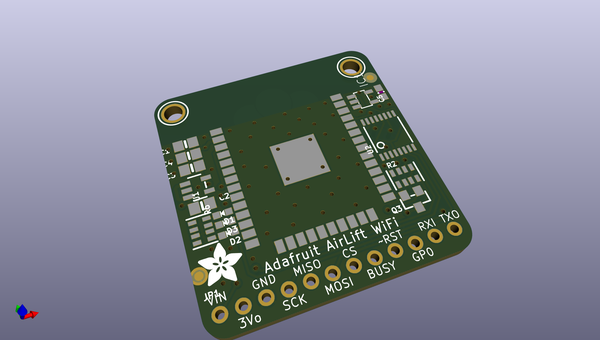
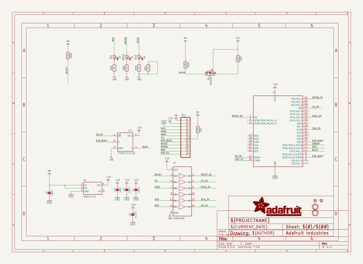
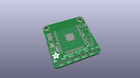
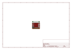
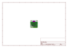
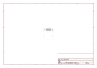
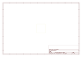
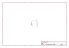

# OOMP Project  
## Adafruit-AirLift-Breakout-PCB  by adafruit  
  
oomp key: oomp_projects_flat_adafruit_adafruit_airlift_breakout_pcb  
(snippet of original readme)  
  
-- Adafruit AirLift – ESP32 WiFi Co-Processor Breakout Board PCB  
  
<a href="http://www.adafruit.com/products/4201">   
Click here to purchase one from the Adafruit shop</a>  
  
PCB files for the Adafruit AirLift – ESP32 WiFi Co-Processor Breakout Board.   
  
Format is EagleCAD schematic and board layout  
* https://www.adafruit.com/product/4201  
  
--- Description  
  
Give your plain ol' microcontroller project a lift with the Adafruit AirLift - a breakout board that lets you use the powerful ESP32 as a WiFi co-processor. You probably have your favorite microcontroller (like the ATmega328 or ATSAMD51), awesome peripherals and lots of libraries. But it doesn't have WiFi built in! So lets give that chip a best friend, the ESP32. This chip can handle all the heavy lifting of connecting to a WiFi network and transferring data from a site, even if its using the latest TLS/SSL encryption (it has root certificates pre-burned in).  
  
Having WiFi managed by a separate chip means your code is simpler, you don't have to cache socket data, or compile in & debug an SSL library. Send basic but powerful socket-based commands over 8MHz SPI for high speed data transfer. You can use 3V or 5V Arduino, any chip from the ATmega328 or up, although the '328 will not be able to do very complex tasks or buffer a lot of data. It also works great with CircuitPython, a SAMD51/Cortex M4 minimum required since we need a bunch of RAM. All you need is an SPI bus and 2 cont  
  full source readme at [readme_src.md](readme_src.md)  
  
source repo at: [https://github.com/adafruit/Adafruit-AirLift-Breakout-PCB](https://github.com/adafruit/Adafruit-AirLift-Breakout-PCB)  
## Board  
  
  
## Schematic  
  
  
  
[schematic pdf](working_schematic.pdf)  
## Images  
  
  
  
  
  
  
  
  
  
  
  
  
  
  
  
  
