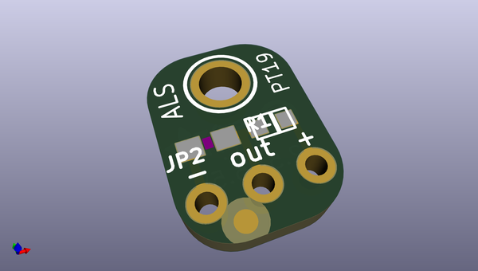
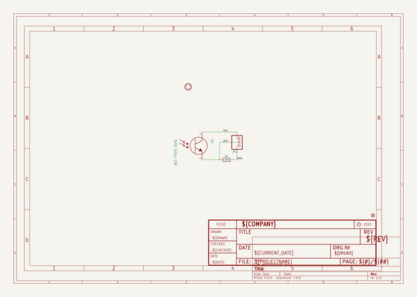
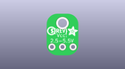
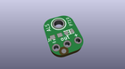
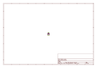
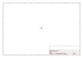
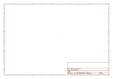
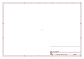

# OOMP Project  
## Adafruit-ALS-PT19-Sensor-Breakout-PCB  by adafruit  
  
oomp key: oomp_projects_flat_adafruit_adafruit_als_pt19_sensor_breakout_pcb  
(snippet of original readme)  
  
-- Adafruit ALS-PT19 Analog Light Sensor Breakout PCB  
<a href="http://www.adafruit.com/products/2748">   
Click here to purchase one from the Adafruit shop</a>  
  
Add a teeny analog light sensor, the ALS PT19 analog light sensor is a great way to upgrade a project that uses a photocell and needs RoHS compliance. Due to the high rejection ratio of infrared radiation, the spectral response of the ambient light sensor is close to that of human eyes.  
  
PCB files for the Adafruit ALS-PT19 Sensor Breakout. The format is EagleCAD schematic and board layout  
- https://www.adafruit.com/product/2748  
  
--- License  
  
Adafruit invests time and resources providing this open source design, please support Adafruit and open-source hardware by purchasing products from [Adafruit](https://www.adafruit.com)!  
  
All text above must be included in any redistribution  
  
Designed by Limor Fried/Ladyada for Adafruit Industries.  
Creative Commons Attribution/Share-Alike, all text above must be included in any redistribution.   
See license.txt for additional information.  
  
  full source readme at [readme_src.md](readme_src.md)  
  
source repo at: [https://github.com/adafruit/Adafruit-ALS-PT19-Sensor-Breakout-PCB](https://github.com/adafruit/Adafruit-ALS-PT19-Sensor-Breakout-PCB)  
## Board  
  
  
## Schematic  
  
  
  
[schematic pdf](working_schematic.pdf)  
## Images  
  
  
  
  
  
  
  
  
  
  
  
  
  
  
  
  
