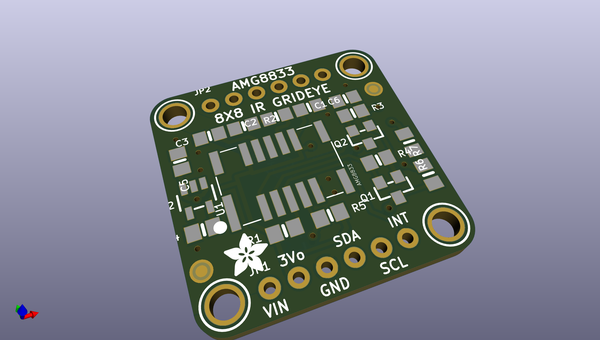
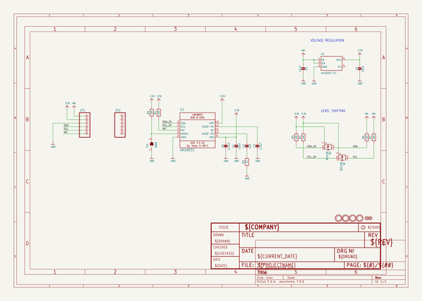
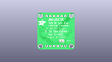
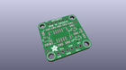
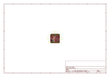
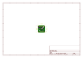
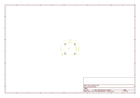
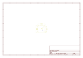
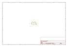

# OOMP Project  
## Adafruit-AMG8833-Breakout-PCB  by adafruit  
  
(snippet of original readme)  
  
-- Adafruit AMG8833 Breakout PCB  
  
<a href="http://www.adafruit.com/products/3538">   
<a href="http://www.adafruit.com/products/3538">   
Click here to purchase one from the Adafruit shop</a>  
  
PCB files for the Adafruit AMG8833 8x8 IR sensor breakout board. Format is EagleCAD schematic and board layout  
  
For more details, check out the product page at  
* https://www.adafruit.com/products/3538  
  
--- Description  
  
Add heat-vision to your project and with an Adafruit AMG8833 Grid-EYE Breakout! This sensor from Panasonic is an 8x8 array of IR thermal sensors. When connected to your microcontroller (or raspberry Pi) it will return an array of 64 individual infrared temperature readings over I2C. It's like those fancy thermal cameras, but compact and simple enough for easy integration.  
  
This part will measure temperatures ranging from 0°C to 80°C (32°F to 176°F) with an accuracy of +- 2.5°C (4.5°F). It can detect a human from a distance of up to 7 meters (23) feet. With a maximum frame rate of 10Hz, It's perfect for creating your own human detector or mini thermal camera. We have code for using this breakout on an Arduino or compatible (the sensor communicates over I2C) or on a Raspberry Pi with Python. On the Pi, with a bit of image processing help from the SciPy python library we were able to interpolate the 8x8 grid and get some pretty nice results!  
  
The AMG8833 is the next gener  
  full source readme at [readme_src.md](readme_src.md)  
  
source repo at: [https://github.com/adafruit/Adafruit-AMG8833-Breakout-PCB](https://github.com/adafruit/Adafruit-AMG8833-Breakout-PCB)  
## Board  
  
  
## Schematic  
  
  
  
[schematic pdf](working_schematic.pdf)  
## Images  
  
  
  
  
  
  
  
  
  
  
  
  
  
  
  
  
