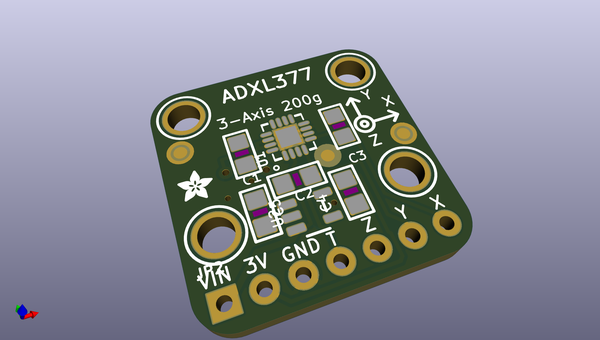

# OOMP Project  
## Adafruit-Analog-Accelerometers-PCBs  by adafruit  
  
(snippet of original readme)  
  
- PCBs for the Adafruit Analog Accelerometers - ADXL335, ADXL377 and ADXL326  
  
<a href="http://www.adafruit.com/products/163"> Click here to purchase one from the Adafruit shop</a>  
  
* [ADXL335 - 5V ready triple-axis accelerometer (+-3g analog out)](https://www.adafruit.com/products/163)  
* [ADXL326 - 5V ready triple-axis accelerometer (+-16g analog out)](https://www.adafruit.com/product/1018)  
* [ADXL377 - High-G Triple-Axis Accelerometer (+-200g Analog Out)](https://www.adafruit.com/product/1413)  
  
We've updated our favorite triple-axis accelerometer to now have an on-board 3.3V regulator - making it a perfect choice for interfacing with a 5V microcontroller such as the Arduino. This breakout comes with 3 analog outputs for X, Y and Z axis measurements on a 0.75"x0.75" breakout board. The ADXL335 is the latest and greatest from Analog Devices, known for their exceptional quality MEMS devices. The VCC takes up to 5V in and regulates it to 3.3V with an output pin. The analog outputs are ratiometric: that means that 0g measurement output is always at half of the 3.3V output (1.65V), -3g is at 0v and 3g is at 3.3V with full scaling in between.  
  
Fully assembled and tested. Comes with 8 pin 0.1" standard header in case you want to use it with a breadboard or perfboard. Two 2mm (0.08") mounting holes for easy attachment.  
  
The XYZ filter capacitors are 0.1uF for a 50 Hz bandwidth  
  
-- License  
  
Adafruit invests time and resources prov  
  full source readme at [readme_src.md](readme_src.md)  
  
source repo at: [https://github.com/adafruit/Adafruit-Analog-Accelerometers-PCBs](https://github.com/adafruit/Adafruit-Analog-Accelerometers-PCBs)  
## Board  
  
  
## Schematic  
  
  
  
[schematic pdf](working_schematic.pdf)  
## Images  
  
  
  
  
  
  
  
  
  
  
  
  
  
  
  
  
