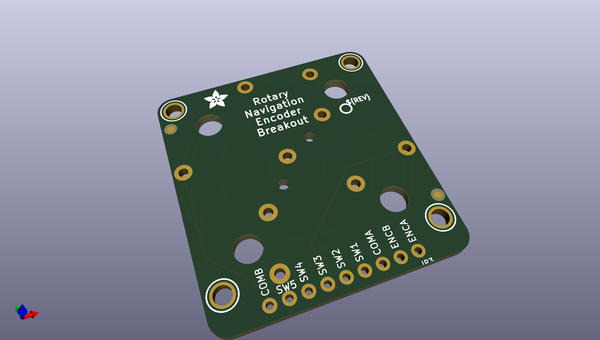
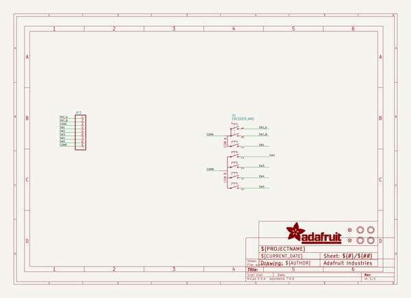
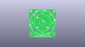
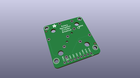
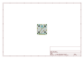
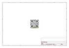
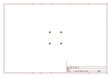
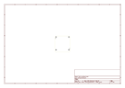
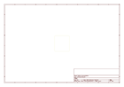

# OOMP Project  
## Adafruit-ANO-Rotary-Navigation-Encoder-Breakout-PCB  by adafruit  
  
oomp key: oomp_projects_flat_adafruit_adafruit_ano_rotary_navigation_encoder_breakout_pcb  
(snippet of original readme)  
  
-- Adafruit ANO Rotary Navigation Encoder Breakout PCB  
  
<a href="http://www.adafruit.com/products/5221">   
Click here to purchase one from the Adafruit shop</a>  
  
PCB files for the Adafruit ANO Rotary Navigation Encoder Breakout.   
  
Format is EagleCAD schematic and board layout  
* https://www.adafruit.com/product/5221  
  
--- Description  
  
The ANO rotary encoder wheel is a funky user interface element is reminiscent of the original clicking scroll wheel interface on the first  iPods. It's a nifty kit, but the pin-out is a little odd, so we made a handy breakout board that converts the funky pin set into a straight forward, breadboard-friendly header strip.  
  
There's no pull-up or pull-down resistors on this PCB, and of course you'll need to solder the encoder onto the breakout. Then use your microcontroller's button and rotary encoder library/hardware support to interface with the pins.  
  
You'll need 7 GPIO total: 5 buttons and 2 rotary encoder pins. There's also two COMmon pins, which you can set to ground or VCC - usually ground so that you can use the microcontroller internal pull-ups for the button/encoders. Note to make our wiring simple, our example code uses GPIO to the COM's and then sets then to outputs, but you can just wire them directly.  
  
--- License  
  
Adafruit invests time and resources providing this open source design, please support Adafruit and open-source hardware by purchasing products from [Adafruit](https://www.a  
  full source readme at [readme_src.md](readme_src.md)  
  
source repo at: [https://github.com/adafruit/Adafruit-ANO-Rotary-Navigation-Encoder-Breakout-PCB](https://github.com/adafruit/Adafruit-ANO-Rotary-Navigation-Encoder-Breakout-PCB)  
## Board  
  
  
## Schematic  
  
  
  
[schematic pdf](working_schematic.pdf)  
## Images  
  
  
  
  
  
  
  
  
  
  
  
  
  
  
  
  
