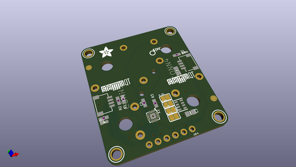
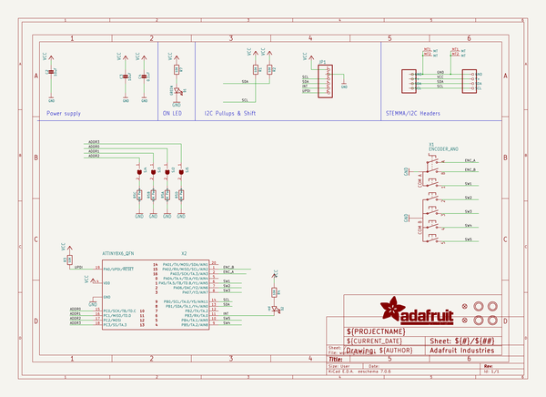
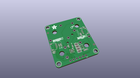
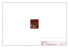
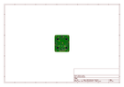
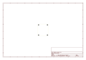
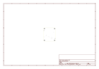
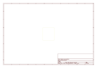
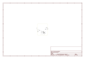

# OOMP Project  
## Adafruit-ANO-Rotary-Navigation-Encoder-to-I2C  by adafruit  
  
(snippet of original readme)  
  
-- Adafruit ANO Rotary Navigation Encoder to I2C Stemma QT Adapter PCB  
  
<a href="http://www.adafruit.com/products/5740">   
Click here to purchase one from the Adafruit shop</a>  
  
PCB files for the Adafruit ANO Rotary Navigation Encoder to I2C Stemma QT Adapter.   
  
Format is EagleCAD schematic and board layout  
* https://www.adafruit.com/product/5740  
  
--- Description  
  
The ANO rotary encoder wheel is a funky user interface element, reminiscent of the original clicking scroll wheel interface on the first iPods. It's a nifty kit, but the pin-out is a little odd - and there's a ton of pins needed to connect to the rotary encoder and 5 button switches.  
  
This Stemma QT breakout makes all that frustration go away - solder in the ANO Directional Navigation and Scroll Wheel Rotary Encoder (not included). The onboard microcontroller is programmed with our seesaw firmware and will track all pulses and pins for you and then save the incremental value for querying at any time over I2C. Plug it in with a Stemma QT cable for instant rotary goodness, with any kind of microcontroller from an Arduino UNO up to a Raspberry Pi to one of our QT Py's.  
  
You can use our Arduino library to control and read data with any compatible microcontroller. We also have CircuitPython/Python code for use with computers or single-board Linux boards.  
  
Power with 3 to 5V DC, and then use 3 or 5V logic I2C data. The INT pin can be configured to pulse low whenever rot  
  full source readme at [readme_src.md](readme_src.md)  
  
source repo at: [https://github.com/adafruit/Adafruit-ANO-Rotary-Navigation-Encoder-to-I2C](https://github.com/adafruit/Adafruit-ANO-Rotary-Navigation-Encoder-to-I2C)  
## Board  
  
  
## Schematic  
  
  
  
[schematic pdf](working_schematic.pdf)  
## Images  
  
  
  
  
  
  
  
  
  
  
  
  
  
  
  
  
