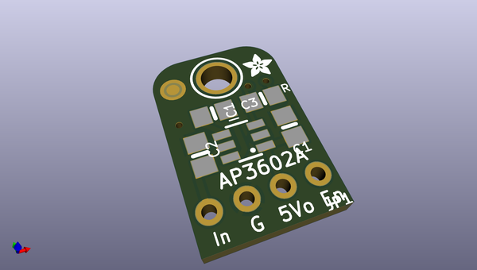
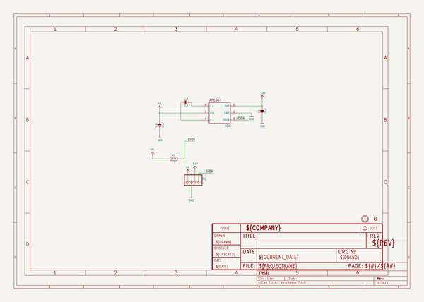
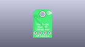
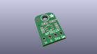
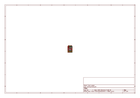
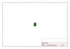
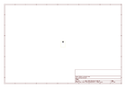
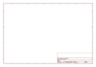

# OOMP Project  
## Adafruit-AP3602A-PCB  by adafruit  
  
oomp key: oomp_projects_flat_adafruit_adafruit_ap3602a_pcb  
(snippet of original readme)  
  
-- Adafruit MiniBoost 5V @ 100mA Charge Pump - AP3602A PCB  
  
<a href="http://www.adafruit.com/products/3661">   
Click here to purchase one from the Adafruit shop</a>  
  
PCB files for the Adafruit MiniBoost 5V @ 100mA Charge Pump - AP3602A.  
  
Format is EagleCAD schematic and board layout  
* https://www.adafruit.com/product/3661  
  
--- Description  
  
This adorable little board will come in very handy whenever you need a small amount of 5V power. It's the size of a linear regulator, but it's actually a mini-booster! Input 3V on one side, and get 5V at up to 100mA supply on the other. Perfect for use with battery-powered projects with 2 or 3 Alkaline, or a single Lithium battery. For big projects, you may want one of our PowerBoost boards that can give you a honkin' 500mA-2A of current.  
  
This booster uses a charge-pump topology, which makes it very compact and low cost. But it isn't as efficient as a inductor-based boost converter. Charge-pumps always double the incoming voltage, and then regulate down. So yeah, not as efficient. So ideal for when you aren't counting coulombs - or when your current draw isn't terribly high.  
  
You get one fully assembled breakout with an AP3602A and components, and a small bit of header. Give 3-5VDC on the IN and ground pins. Then you'll have 5V on the OUT pin. The enable pin can be pulled low to disable the output.  
  
--- License  
  
Adafruit invests time and resources providing this open source design, pleas  
  full source readme at [readme_src.md](readme_src.md)  
  
source repo at: [https://github.com/adafruit/Adafruit-AP3602A-PCB](https://github.com/adafruit/Adafruit-AP3602A-PCB)  
## Board  
  
  
## Schematic  
  
  
  
[schematic pdf](working_schematic.pdf)  
## Images  
  
  
  
  
  
  
  
  
  
  
  
  
  
  
  
  
