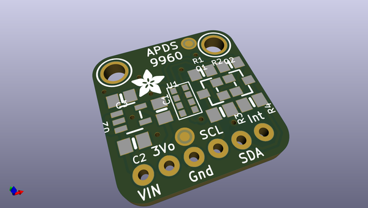
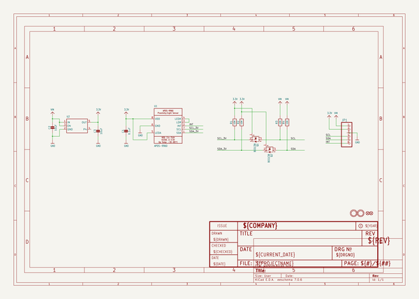
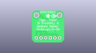
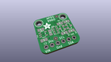
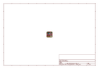
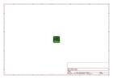
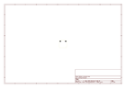
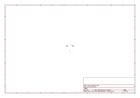
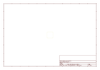

# OOMP Project  
## Adafruit-APDS9960-Breakout-PCB  by adafruit  
  
oomp key: oomp_projects_flat_adafruit_adafruit_apds9960_breakout_pcb  
(snippet of original readme)  
  
-- Adafruit APDS9960 Breakout PCB  
  
<a href="http://www.adafruit.com/products/3595">   
Click here to purchase one from the Adafruit shop</a>  
  
PCB files for the Adafruit APDS9960 IR gesture, proximity, RGB, ambient light sensor breakout board  
  
Format is EagleCAD schematic and board layout  
  
For more details, check out the product page at  
* https://www.adafruit.com/products/3595  
  
--- Description  
  
This breakout is chock full o' sensors! Add basic gesture sensing, RGB color sensing, proximity sensing, or ambient light sensing to your project with the Adafruit APDS9960 Proximity, Light, RGB and Gesture Sensor. When connected to your microcontroller (running our library code) it can detect simple gestures (left to right, right to left, up to down, down to up are currently supported), return the amount of red, blue, green, and clear light, or return how close an object is to the front of the sensor. This device uses an I2C interface so it's easy to wire up and use.  
  
The APDS9960 from Avago Technologies has an integrated IR LED and driver, along with four directional photodiodes that sense reflected IR energy from the LED. It's proximity detection feature allows it to measure the distance an object is from the front of the sensor (up to a few centimeters) with 8 bit resolution.  
  
Since there are four IR sensors, you can measure the changes in light reflectance at each of the cardinal locations over time and turn those changes into ge  
  full source readme at [readme_src.md](readme_src.md)  
  
source repo at: [https://github.com/adafruit/Adafruit-APDS9960-Breakout-PCB](https://github.com/adafruit/Adafruit-APDS9960-Breakout-PCB)  
## Board  
  
  
## Schematic  
  
  
  
[schematic pdf](working_schematic.pdf)  
## Images  
  
  
  
  
  
  
  
  
  
  
  
  
  
  
  
  
