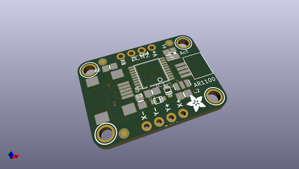
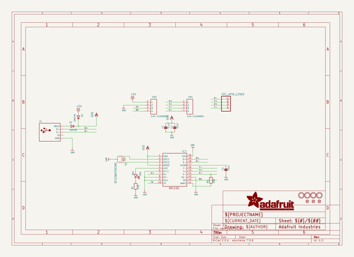
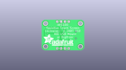
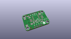
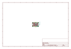
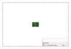
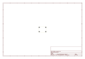
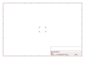
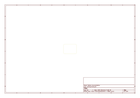
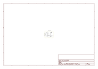

# OOMP Project  
## Adafruit-AR1100-Resistive-Touch-Controller-PCB  by adafruit  
  
(snippet of original readme)  
  
-- Adafruit AR1100 Resistive Touch Controller PCB  
<a href="http://www.adafruit.com/products/1580">   
Click here to purchase one from the Adafruit shop</a>  
  
Getting touchy performance with your screen's touch screen? Resistive touch screens are incredibly popular as overlays to TFT and LCD displays. If you want to connect one to a computer you need something to handle the analog to digital conversion. Most converters we've found are not very easy to use, and are 'fixed' - making them difficult to calibrate. The AR1100 is a nice chip that solves this problem by acting as a touch->USB converter and also comes with calibration software. The calibration software is Windows only, but once you've calibrated you can use the screen on any OS. The AR1100 shows up as a regular Mouse or Digitizer HID device so no drivers are required. We've tested it sucessfully on Mac, Windows, and Debian Linux (Raspbian on a Raspberry Pi). Other Linux distributions may or may not work, but if you're running Linux you're probably used to that.  
  
This breakout board features the AR1100, which has both USB and UART interfaces available. 99% of the time, you'll want to use the USB interface but there is some functionality for getting TTL UART data out (see the datasheet for details) There is also a red LED that lights up to indicate when a touch has been detected.  
  
PCB files for the Adafruit AR1100 Resistive Touch Controller. The format is EagleCAD schem  
  full source readme at [readme_src.md](readme_src.md)  
  
source repo at: [https://github.com/adafruit/Adafruit-AR1100-Resistive-Touch-Controller-PCB](https://github.com/adafruit/Adafruit-AR1100-Resistive-Touch-Controller-PCB)  
## Board  
  
  
## Schematic  
  
  
  
[schematic pdf](working_schematic.pdf)  
## Images  
  
  
  
  
  
  
  
  
  
  
  
  
  
  
  
  
