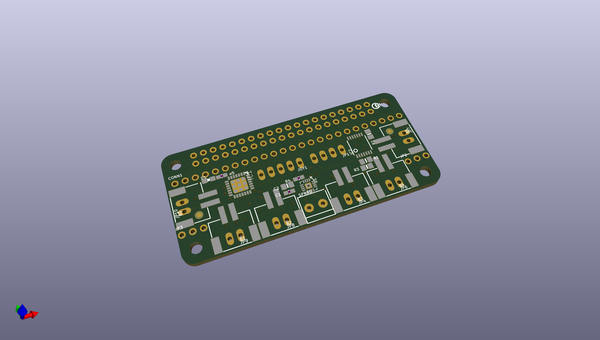
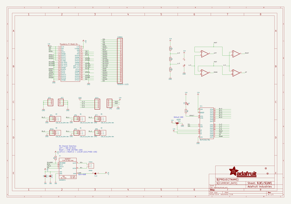
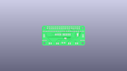
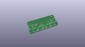
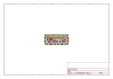
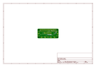
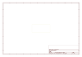
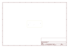
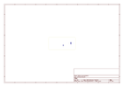
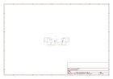

# OOMP Project  
## Adafruit-Arcade-Bonnet-PCB  by adafruit  
  
(snippet of original readme)  
  
-- Adafruit Arcade Bonnet PCB  
  
<a href="http://www.adafruit.com/products/3422">   
Click here to purchase one from the Adafruit shop</a>  
  
PCB files for the Adafruit Arcade Bonnet. Format is EagleCAD schematic and board layout  
* http://www.adafruit.com/product/3422  
  
--- Description  
  
Playing retro games is easy on a Raspberry Pi - and that pocket-sized computer is pretty good at it too! All you need is a little help to connect buttons and a joystick up and you can custom design your own arcade console, desktop or stand-up machine, even just a simple controller box. It makes for a fun weekend project that will last all year.  
  
This Adafruit Arcade Bonnet is designed to make small emulator projects a little easier to build. Here's what you can look forward to!  
  
* It is the same size as a Pi Zero, so for really compact builds, this is super small. You can also use it with a Pi 2, 3, B+ or any 2x20 connector Pi.  
* It has JST sockets so you can plug in six arcade buttons easily using our quick connects.  
* Header breakouts for use with both clicky-type switched joysticks and...  
* Header breakout and converter for using analog-type joysticks or thumbsticks with potentiometers inside.  
* A 3W digital speaker output that can drive 4-8 ohm speakers for when using with a TV output, audio-less HDMI display or PiTFT. Works even when the Pi doesn't have a headphone jack!  
* Switches are all managed with an I2C-GPIO converter with interrupt ou  
  full source readme at [readme_src.md](readme_src.md)  
  
source repo at: [https://github.com/adafruit/Adafruit-Arcade-Bonnet-PCB](https://github.com/adafruit/Adafruit-Arcade-Bonnet-PCB)  
## Board  
  
  
## Schematic  
  
  
  
[schematic pdf](working_schematic.pdf)  
## Images  
  
  
  
  
  
  
  
  
  
  
  
  
  
  
  
  
