# OOMP Project  
## Adafruit-AS7262-Breakout-PCB  by adafruit  
  
oomp key: oomp_projects_flat_adafruit_adafruit_as7262_breakout_pcb  
(snippet of original readme)  
  
-- Adafruit AS7262 Channel Visible Light / Color Sensor Breakout PCB  
  
<a href="http://www.adafruit.com/products/3779">   
Click here to purchase one from the Adafruit shop</a>  
  
PCB files for AS7262 breakout. Format is EagleCAD schematic and board layout  
  
For more details, check out the product page at  
* https://www.adafruit.com/products/3779  
  
--- Description  
  
Detect trees of green, and red roses too with the new Adafruit AS7262 6-Channel Visible Light / Color Sensor Breakout. This sensor from AMS has 6 integrated visible light sensing channels for red, orange, yellow, green, blue, and violet. These channels can be read via the I2C bus as either raw 16-bit values or calibrated floating-point values. There is also an on-board temperature sensor that can be used to read the temperature of the chip, and a powerful LED flash to reflect light off objects for better color detection.  
  
The 6 channels on the AS7262 are realized by silicon interference filters at 450nm, 500nm, 550nm, 570nm, 600nm, and 650nm. This breakout uses the I2C interface on the chip by default, but a UART interface that accepts AT commands is also selectable.  
  
We've placed the sensor on a PCB for you and included an SPI flash chip pre-programmed with the device firmware, a 3.3V regulator, I2C level shifting, and the recommended LED flash. Both the I2C and UART interfaces are broken out, making this breakout an excellent all-in-one solution for all your color-se  
  full source readme at [readme_src.md](readme_src.md)  
  
source repo at: [https://github.com/adafruit/Adafruit-AS7262-Breakout-PCB](https://github.com/adafruit/Adafruit-AS7262-Breakout-PCB)  
## Board  
  
[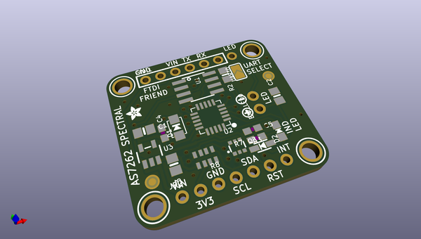](working_3d.png)  
## Schematic  
  
[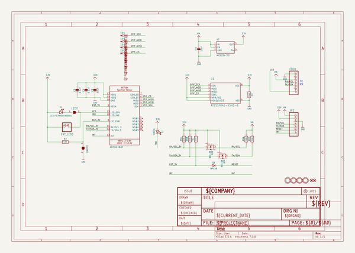](working_schematic.png)  
  
[schematic pdf](working_schematic.pdf)  
## Images  
  
[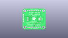](working_3D_bottom.png)  
  
[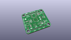](working_3D_top.png)  
  
[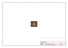](working_assembly_page_01.png)  
  
[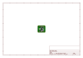](working_assembly_page_02.png)  
  
[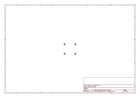](working_assembly_page_03.png)  
  
[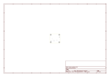](working_assembly_page_04.png)  
  
[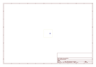](working_assembly_page_05.png)  
  
[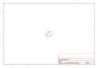](working_assembly_page_06.png)  
  
[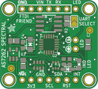](working_top.png)  
