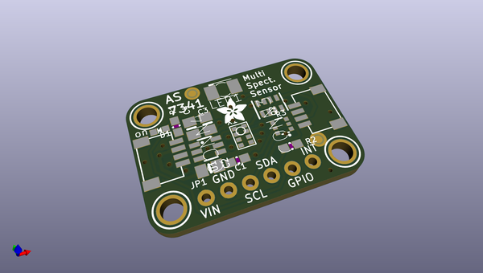
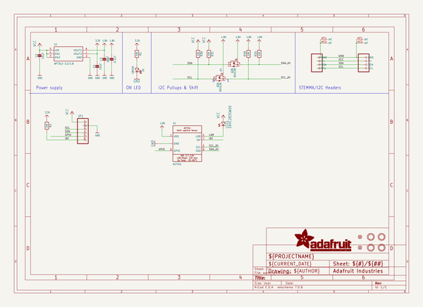
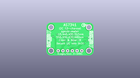
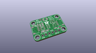
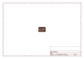
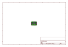
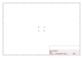
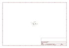

# OOMP Project  
## Adafruit-AS7341-PCB  by adafruit  
  
oomp key: oomp_projects_flat_adafruit_adafruit_as7341_pcb  
(snippet of original readme)  
  
-- Adafruit AS7341 10-Channel Light / Color Breakout PCB  
  
<a href="http://www.adafruit.com/products/4698">   
Click here to purchase one from the Adafruit shop</a>  
  
PCB files for the Adafruit AS7341 10-Channel Light / Color Breakout.   
  
Format is EagleCAD schematic and board layout  
* https://www.adafruit.com/product/4698  
  
--- Description  
  
INSERT PRODUCT COPY HERE  
The AS7341 by AMS is a 11/10 channel spectrometer which is a special type of light sensor that is able to detect not only the amount of light present, but also the amounts of light within different wavelengths. This means that you can use it to detect, much better than the human eye is capable of, what color or colors of light is present. The AS7341 packs within its 3x2mm footprint 16 different sensors that can detect 8 separate, overlapping bands of colored light. As if that weren't enough, it also includes sensors for white light as well as Near Infra-red light, and even sensors made specifically for detecting light flicker at specific frequencies from things like indoor lighting.  
  
The super-human color measuring capabilities of the AS7341 can be used to quantify the specific makeup of whatever interesting colors you can point it at, and can do so with more accuracy and specificity than a well trained artist. Now you don't need to go to art school to tell Pavo from Smalt, instead you can have the AS7341 can give you a clue how blue your blue is. This is possible th  
  full source readme at [readme_src.md](readme_src.md)  
  
source repo at: [https://github.com/adafruit/Adafruit-AS7341-PCB](https://github.com/adafruit/Adafruit-AS7341-PCB)  
## Board  
  
  
## Schematic  
  
  
  
[schematic pdf](working_schematic.pdf)  
## Images  
  
  
  
  
  
  
  
  
  
  
  
  
  
  
  
  
