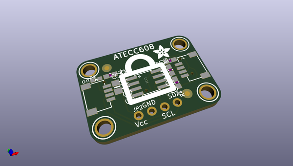
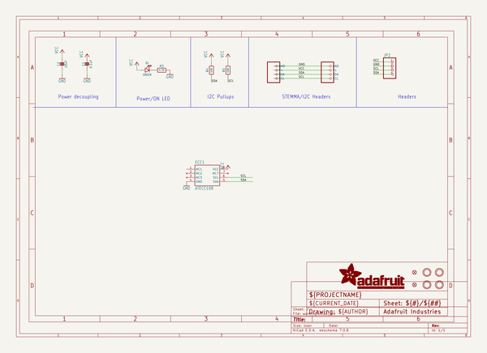
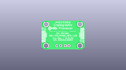
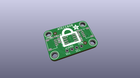
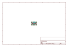
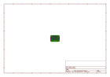
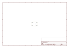

# OOMP Project  
## Adafruit-ATECC608-PCB  by adafruit  
  
(snippet of original readme)  
  
-- Adafruit Adafruit ATECC608 Breakout Board - STEMMA QT / Qwiic PCB  
  
<a href="http://www.adafruit.com/products/4314">   
Click here to purchase one from the Adafruit shop</a>  
  
PCB files for the Adafruit Adafruit ATECC608 Breakout Board - STEMMA QT / Qwiic.   
  
Format is EagleCAD schematic and board layout  
* https://www.adafruit.com/product/4314  
  
--- Description  
  
You've got secrets, and you want to keep them safe? Most microcontrollers are not designed to protect against snoopers, but a crypto-authentication chip can be used to lock away private keys securely. Once the private key is saved inside, it can't be read out, all you can do is send it challenge-response queries. That means that even if someone gets hold of your hardware and can read back the firmware, they wont be able to extract the secret!  
  
The ATECC608 is the latest crypto-auth chip from Microchip, and it uses I2C to send/receive commands. Once you 'lock' the chip with your details, you can use it for ECDH and AES-128 encrypt/decrypt/signing. There's also hardware support for random number generation, and SHA-256/HMAC hash functions to  greatly speed up a slower micro's cryptography commands.  
  
--- License  
  
Adafruit invests time and resources providing this open source design, please support Adafruit and open-source hardware by purchasing products from [Adafruit](https://www.adafruit.com)!  
  
Designed by Limor Fried/Ladyada for Adafruit Industries.  
  
Creative Commons   
  full source readme at [readme_src.md](readme_src.md)  
  
source repo at: [https://github.com/adafruit/Adafruit-ATECC608-PCB](https://github.com/adafruit/Adafruit-ATECC608-PCB)  
## Board  
  
  
## Schematic  
  
  
  
[schematic pdf](working_schematic.pdf)  
## Images  
  
  
  
  
  
  
  
  
  
  
  
  
  
  
  
  
