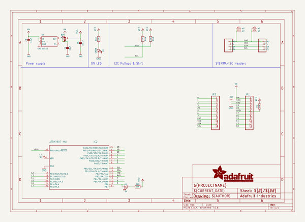

# OOMP Project  
## Adafruit-ATtiny8x7-Breakout-PCB  by adafruit  
  
(snippet of original readme)  
  
-- Adafruit ATtiny8x7 Breakout PCB  
  
<a href="http://www.adafruit.com/products/5233">   
Click here to purchase one from the Adafruit shop</a>  
  
PCB files for the Adafruit ATtiny8x7 Breakout.   
  
Format is EagleCAD schematic and board layout  
* https://www.adafruit.com/product/5233  
  
--- Description  
  
This breakout board is a "three in one" product:  
  
1. The ATtiny817 is part of the 'next gen' of AVR microcontrollers, and now we have a cute development/breakout board for it, with just enough hardware to get the chip up and running.  
2. It's also an Adafruit seesaw board. Adafruit seesaw is a near-universal converter framework which allows you to add and extend hardware support to any I2C-capable microcontroller or microcomputer. Instead of getting separate I2C GPIO expanders, ADCs, PWM drivers, etc, seesaw can be configured to give a wide range of capabilities.  
3. Finally, with STEMMA QT connectors on it, you could use it as either an I2C controller or peripheral with plug-and play support.  
  
We primarily designed this board for our own use: it's a mini dev board that lets us design with the ATtiny817 just like we did for the ATSAMD09. With the 2021 silicon shortage, we're adapting some of our SAMD09 designs to the ATTiny8xx series and wanted a quick minimal board to test code on.  
  
Each breakout comes with the assembled and tested board, as well as some header strips. Each PCB is fairly minimal and contains:  
  
* ATtiny817 8-bit microco  
  full source readme at [readme_src.md](readme_src.md)  
  
source repo at: [https://github.com/adafruit/Adafruit-ATtiny8x7-Breakout-PCB](https://github.com/adafruit/Adafruit-ATtiny8x7-Breakout-PCB)  
## Board  
  
  
## Schematic  
  
  
  
[schematic pdf](working_schematic.pdf)  
## Images  
  
  
  
  
  
  
  
  
  
  
  
  
  
  
  
  
