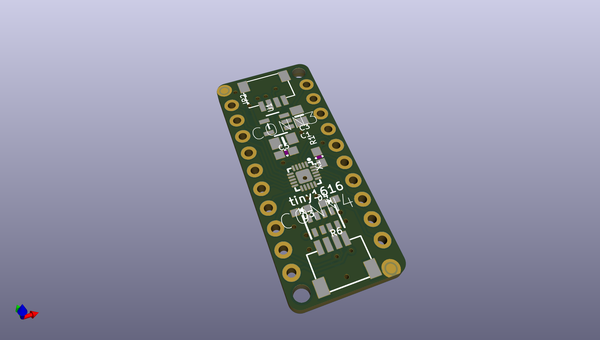
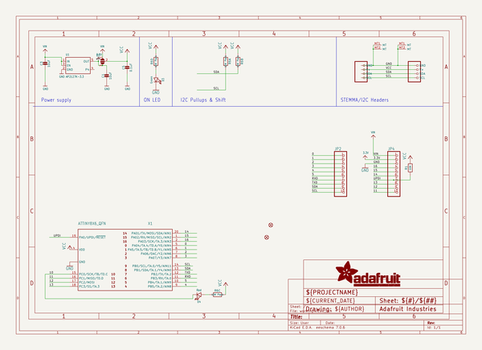
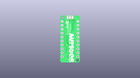
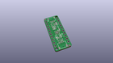
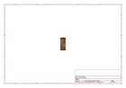
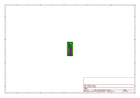
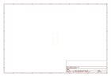
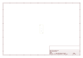
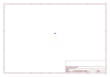
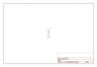

# OOMP Project  
## Adafruit-ATtinyx16-Breakouts-PCB  by adafruit  
  
(snippet of original readme)  
  
-- Adafruit ATtinyx16 Breakouts with seesaw - STEMMA QT / Qwiic PCB  
  
<a href="http://www.adafruit.com/products/5681">   
Click here to purchase one from the Adafruit shop</a>  
<a href="http://www.adafruit.com/products/5690">   
Click here to purchase one from the Adafruit shop</a>  
  
PCB files for the Adafruit ATtiny816 and ATtiny1616 Breakouts with seesaw - STEMMA QT / Qwiic.   
  
Format is EagleCAD schematic and board layout  
* https://www.adafruit.com/product/5681  
* https://www.adafruit.com/product/5690  
  
--- Description  
  
These breakout boards are a "three in one" product:  
  
* The ATtinyx16 are part of the 'next gen' of AVR microcontrollers, and now we have cute development/breakout boards for them, with just enough hardware to get the chip up and running.  
* It's also an Adafruit seesaw board. Adafruit seesaw is a near-universal converter framework which allows you to add and extend hardware support to any I2C-capable microcontroller or microcomputer. Instead of getting separate I2C GPIO expanders, ADCs, PWM drivers, etc, seesaw can be configured to give a wide range of capabilities.  
* Finally, with STEMMA QT connectors on it, you could use it as either an I2C controller or peripheral with plug-and play support.  
  
We primarily designed this board for our own use: it's a mini dev board that lets us design with the ATtiny816 just like we did for the ATSAMD09. With the 2021-202  
  full source readme at [readme_src.md](readme_src.md)  
  
source repo at: [https://github.com/adafruit/Adafruit-ATtinyx16-Breakouts-PCB](https://github.com/adafruit/Adafruit-ATtinyx16-Breakouts-PCB)  
## Board  
  
  
## Schematic  
  
  
  
[schematic pdf](working_schematic.pdf)  
## Images  
  
  
  
  
  
  
  
  
  
  
  
  
  
  
  
  
