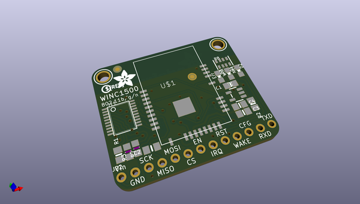
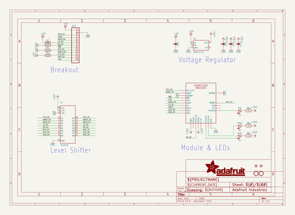
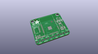
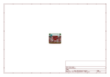
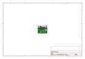
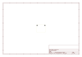
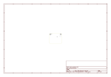
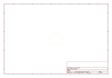
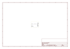

# OOMP Project  
## Adafruit-ATWINC1500-WiFi-Breakout-PCB  by adafruit  
  
oomp key: oomp_projects_flat_adafruit_adafruit_atwinc1500_wifi_breakout_pcb  
(snippet of original readme)  
  
-- Adafruit ATWINC1500 WiFi Breakout PCB  
&nbsp;    
Click to purchase from the Adafruit Shop:  
- [Adafruit ATWINC1500 WiFi Breakout](https://www.adafruit.com/product/2999)  
- [Adafruit ATWINC1500 WiFi Breakout with uFL Connector - fw 19.4.4](https://www.adafruit.com/product/3060)  
  
These 802.11bgn-capable WiFi modules are the best new thing for networking your devices, with SSL support and rock solid performance - running our adafruit.io MQTT demo for a full weekend straight with no hiccups (it would have run longer but we had to go to work, so we unplugged it). We like these so much, they've completely replaced the CC3000 module on all our projects.  
  
The Adafruit ATWINC1500 WiFi Breakouts use SPI to communicate, so with about 6 wires, you can get your wired up and ready to go. And scanning/connecting to networks is very fast, a few seconds.  
  
These modules work with 802.11b, g, or n networks & supports WEP, WPA and WPA2 encryption. You can use them in Soft AP mode to create an ad-hoc network. For secure client connections, there is TLS 1.2 support in firmware 19.4.4!  
  
PCB files for the Adafruit ATWINC1500 WiFi Breakout. The format is EagleCAD schematic and board layout  
  
For more details, check out the product pages at  
  
   * https://www.adafruit.com/product/2999  
   * https://w  
  full source readme at [readme_src.md](readme_src.md)  
  
source repo at: [https://github.com/adafruit/Adafruit-ATWINC1500-WiFi-Breakout-PCB](https://github.com/adafruit/Adafruit-ATWINC1500-WiFi-Breakout-PCB)  
## Board  
  
  
## Schematic  
  
  
  
[schematic pdf](working_schematic.pdf)  
## Images  
  
  
  
  
  
  
  
  
  
  
  
  
  
  
  
  
