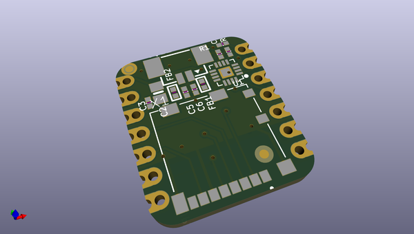
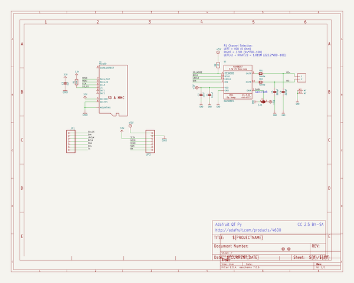
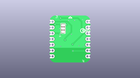
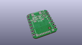
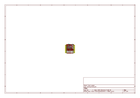
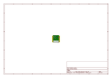
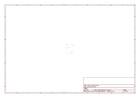
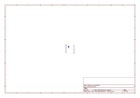

# OOMP Project  
## Adafruit-Audio-BFF-PCB  by adafruit  
  
oomp key: oomp_projects_flat_adafruit_adafruit_audio_bff_pcb  
(snippet of original readme)  
  
-- Adafruit Audio BFF Add-on for QT Py and Xiao PCB  
  
<a href="http://www.adafruit.com/products/5769">   
Click here to purchase one from the Adafruit shop</a>  
  
PCB files for the Adafruit Audio BFF Add-on for QT Py and Xiao.   
  
Format is EagleCAD schematic and board layout  
* https://www.adafruit.com/product/5769  
  
--- Description  
  
Our QT Py boards are a great way to make very small microcontroller projects that pack a ton of power - and now we have a way for you to turn many QT Py boards into powerful audio play projects that are super small!  
  
This BFF comes with a MicroSD card slot that can address up to 64 GB of storage and a I2S 3 Watt amplifier, for high-quality audio playback, that can fit on the back of your miniature dev board. All together uses the SPI port plus 4 GPIO pins for card CS, and I2S data, clock and left-right select.  
  
We call this the Adafruit Audio BFF - a "Best Friend Forever". When you were a kid, you may have learned about the "buddy" system; well, this product is kinda like that! A board that will watch your QT Py's back and give it more capabilities.  
  
This PCB is designed to fit onto the back of any QT Py or Xiao board, it can be soldered into place or use pin and socket headers to make it removable. Onboard is a MAX98357 audio amplifier and picoblade-compatible connector for plugging in a 4 or 8 ohm speaker. We use A1 for the audio data, A2 for wordselect clock, and A3 for bitclock. The SD card connec  
  full source readme at [readme_src.md](readme_src.md)  
  
source repo at: [https://github.com/adafruit/Adafruit-Audio-BFF-PCB](https://github.com/adafruit/Adafruit-Audio-BFF-PCB)  
## Board  
  
  
## Schematic  
  
  
  
[schematic pdf](working_schematic.pdf)  
## Images  
  
  
  
  
  
  
  
  
  
  
  
  
  
  
  
  
