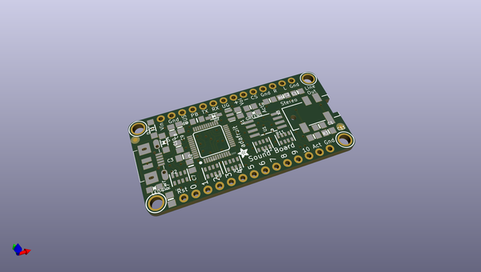
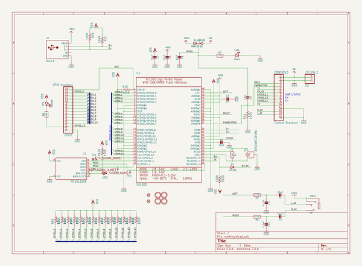
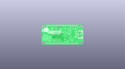
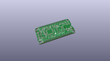
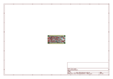
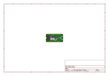
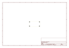
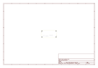
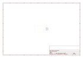
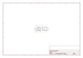

# OOMP Project  
## Adafruit-Audio-FX-Sound-Board-PCBs  by adafruit  
  
(snippet of original readme)  
  
- Adafruit Audio FX Sound Boards PCBs  
<a href="http://www.adafruit.com/products/2133">   
Click here to purchase one from the Adafruit shop</a>  
  
Would you like to add audio/sound effects to your next project, without an Arduino+Shield? Or maybe you don't even know how to use microcontrollers, you just want to make a sound play whenever you press a button. What about something that has to be small and portable? You are probably feeling a little frustrated: it's been very hard to find a simple, low cost audio effects trigger that is easy to use and does not require any programming  
  
For more details, check out the product pages at  
  
   * https://www.adafruit.com/products/2133  
   * https://www.adafruit.com/products/2220  
   * https://www.adafruit.com/products/2341  
   * https://www.adafruit.com/products/2342  
   * https://www.adafruit.com/products/2210  
   * https://www.adafruit.com/products/2217  
     
PCB files for the Adafruit Audio FX Sound Boards. The format is EagleCAD schematic and board layout  
  
--- License  
  
Adafruit invests time and resources providing this open source design, please support Adafruit and open-source hardware by purchasing products from [Adafruit](https://www.adafruit.com)!  
  
All text above must be included in any redistribution  
  
Designed by Limor Fried/Ladyada for Adafruit Industries.  
Creative Commons Attribution/Share-Alike, all text above must be included in any redistribution.   
See license.txt for additional   
  full source readme at [readme_src.md](readme_src.md)  
  
source repo at: [https://github.com/adafruit/Adafruit-Audio-FX-Sound-Board-PCBs](https://github.com/adafruit/Adafruit-Audio-FX-Sound-Board-PCBs)  
## Board  
  
  
## Schematic  
  
  
  
[schematic pdf](working_schematic.pdf)  
## Images  
  
  
  
  
  
  
  
  
  
  
  
  
  
  
  
  
