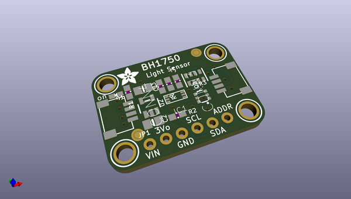
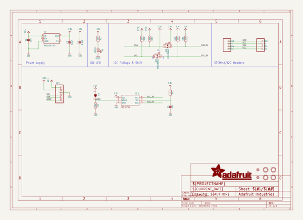
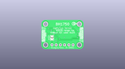
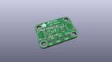
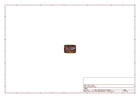
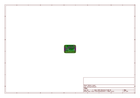
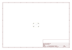
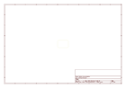
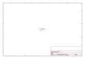

# OOMP Project  
## Adafruit-BH1750-PCB  by adafruit  
  
(snippet of original readme)  
  
-- Adafruit BH1750 Light Sensor - STEMMA QT / Qwiic PCB  
  
<a href="http://www.adafruit.com/products/4681">   
Click here to purchase one from the Adafruit shop</a>  
  
PCB files for the Adafruit BH1750 Light Sensor - STEMMA QT / Qwiic.   
  
Format is EagleCAD schematic and board layout  
* https://www.adafruit.com/product/4681  
  
--- Description  
  
This is the BH1750 16-bit Ambient Light Sensor from Rohm. Because of how important it is to humans and most other living things, sensing the amount of light in an environment is a common place to get started when learning to work with microcontrollers and sensors. Should we turn up the brightness of our display or dim it to save power? Which direction should your robot move to stay in an area with the most light? Is it day or night? All of these questions can be answered with the help of the BH1750. It's a small, capable and inexpensive light sensor that you can include into your next project to add the detection and measurement of light.  
  
--- License  
  
Adafruit invests time and resources providing this open source design, please support Adafruit and open-source hardware by purchasing products from [Adafruit](https://www.adafruit.com)!  
  
Designed by Limor Fried/Ladyada for Adafruit Industries.  
  
Creative Commons Attribution/Share-Alike, all text above must be included in any redistribution.   
See license.txt for additional details.  
  
  full source readme at [readme_src.md](readme_src.md)  
  
source repo at: [https://github.com/adafruit/Adafruit-BH1750-PCB](https://github.com/adafruit/Adafruit-BH1750-PCB)  
## Board  
  
  
## Schematic  
  
  
  
[schematic pdf](working_schematic.pdf)  
## Images  
  
  
  
  
  
  
  
  
  
  
  
  
  
  
  
  
