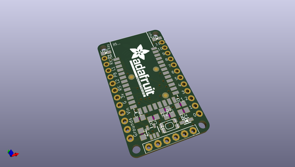
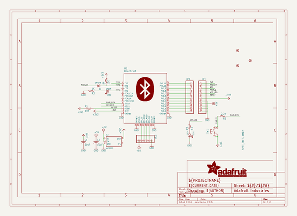
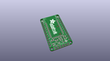
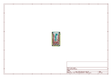
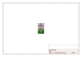
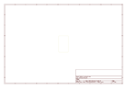
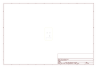
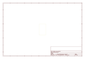
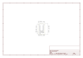

# OOMP Project  
## Adafruit-Bluefruit-EZ-Key-PCB  by adafruit  
  
oomp key: oomp_projects_flat_adafruit_adafruit_bluefruit_ez_key_pcb  
(snippet of original readme)  
  
-- Adafruit Bluefruit EZ Key PCB (Discontinued)  
<a href="http://www.adafruit.com/products/1535">   
Click here to purchase one from the Adafruit shop</a>  
  
**These modules are currently discontinued**  
  
Create your own wireless Bluetooth keyboard controller in an hour with the Bluefruit EZ-Key: it's the fastest, easiest and bestest Bluetooth controller. We spent years learning how to develop our own custom Bluetooth firmware, and coupled with our own BT module hardware, we've created the most Maker-friendly wireless you can get!  
  
This breakout acts just like a BT keyboard, and works great with any BT-capable device: Mac, Windows, Linux, iOS, and Android. Power the module with 3-16VDC, and pair it to the computer, tablet or phone just as you would any other BT device. Now you can connect buttons from the 12 input pins, when a button is pressed, it sends a keypress to the computer. We pre-program the module to send the 4 arrow keys, return, space, 'w', 'a', 's', 'd', '1' and '2' by default. Advanced users can reprogram the module's keys using an FTDI or other Serial console cable, for any HID key report they desire.  
  
PCB files for the Adafruit Bluefruit EZ Key, The format is EagleCAD schematic and board layout  
- https://www.adafruit.com/product/1535  
  
--- License  
  
Adafruit invests time and resources providing this open source design, please support Adafruit and open-source hardware by purchasing products from [Adafruit](https://  
  full source readme at [readme_src.md](readme_src.md)  
  
source repo at: [https://github.com/adafruit/Adafruit-Bluefruit-EZ-Key-PCB](https://github.com/adafruit/Adafruit-Bluefruit-EZ-Key-PCB)  
## Board  
  
  
## Schematic  
  
  
  
[schematic pdf](working_schematic.pdf)  
## Images  
  
  
  
  
  
  
  
  
  
  
  
  
  
  
  
  
