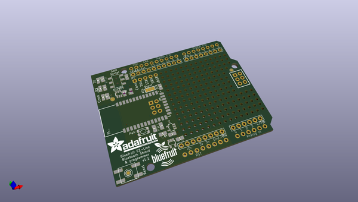
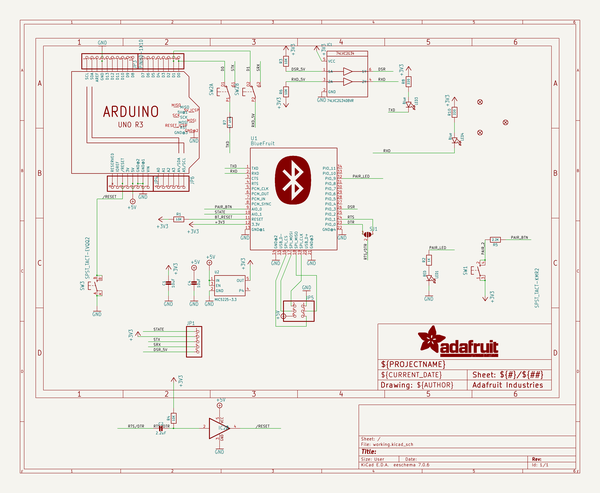

# OOMP Project  
## Adafruit-Bluefruit-EZ-Link-Shield-PCB  by adafruit  
  
(snippet of original readme)  
  
-- Adafruit Bluefruit EZ Link Shield PCB  
<a href="http://www.adafruit.com/products/1628">   
Click here to see this in the Adafruit shop</a>  
  
**Note: Discontinued - this product is currently undergoing a revision and will be available again soon!**  
  
The Bluefruit EZ-Link shield is a regular 'SPP' serial link client device, that can pair with any computer or tablet and appear as a serial/COM port (except iOS as iOS does not permit SPP pairing). But here is where it gets exciting: unlike any other BT module, the EZ-Link can automatically detect and change the serial baud rate. That means if you open up the COM port on your computer at 9600 baud, the output is 9600, 57600? 57600. Yep even 2400. All the most common baud rates are supported: 2400, 4800, 9600, 19200, 38400, 57600, 115200 and 230400. You never have to configure or customize the module by hand - it all happens completely automatically inside the RF module.  
  
PCB files for the Adafruit Bluefruit EZ-Link Shield. The format is EagleCAD schematic and board layout  
- https://www.adafruit.com/product/1628  
  
--- License  
  
Adafruit invests time and resources providing this open source design, please support Adafruit and open-source hardware by purchasing products from [Adafruit](https://www.adafruit.com)!  
  
All text above must be included in any redistribution  
  
Designed by Limor Fried/Ladyada for Adafruit Industries.  
Creative Commons Attribution/Share-Alike, all text above must  
  full source readme at [readme_src.md](readme_src.md)  
  
source repo at: [https://github.com/adafruit/Adafruit-Bluefruit-EZ-Link-Shield-PCB](https://github.com/adafruit/Adafruit-Bluefruit-EZ-Link-Shield-PCB)  
## Board  
  
  
## Schematic  
  
  
  
[schematic pdf](working_schematic.pdf)  
## Images  
  
  
  
  
  
  
  
  
  
  
  
  
  
  
  
  
