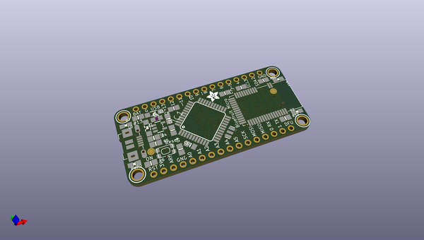
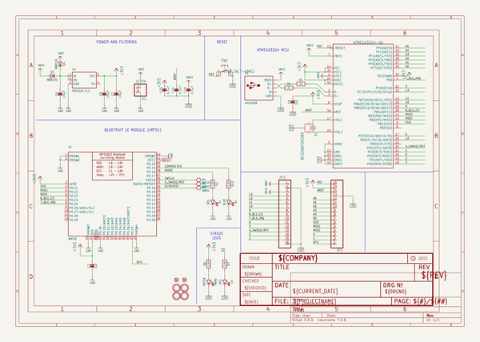
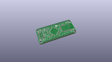
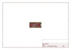
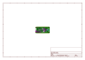
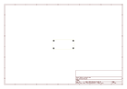
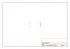
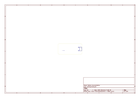
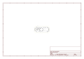

# OOMP Project  
## Adafruit-Bluefruit-LE-Micro-PCB  by adafruit  
  
oomp key: oomp_projects_flat_adafruit_adafruit_bluefruit_le_micro_pcb  
(snippet of original readme)  
  
-- Adafruit Bluefruit LE Micro PCB (Discontinued)  
<a href="http://www.adafruit.com/products/2661">   
See the part listing in the Adafruit shop</a>  
  
DISCONTINUED  
Check out the [Adafruit Feather 32u4 Bluefruit LE](https://www.adafruit.com/products/2829), it's an awesome upgrade!  
  
PCB files for Adafruit Bluefruit LE Micro. Format is EagleCAD.  
- https://www.adafruit.com/product/2661  
  
--- License  
  
Adafruit invests time and resources providing this open source design, please support Adafruit and open-source hardware by purchasing products from [Adafruit](https://www.adafruit.com)!  
  
All text above must be included in any redistribution  
  
Designed by Limor Fried/Ladyada for Adafruit Industries.  
Creative Commons Attribution/Share-Alike, all text above must be included in any redistribution.   
See license.txt for additional information.  
  
  full source readme at [readme_src.md](readme_src.md)  
  
source repo at: [https://github.com/adafruit/Adafruit-Bluefruit-LE-Micro-PCB](https://github.com/adafruit/Adafruit-Bluefruit-LE-Micro-PCB)  
## Board  
  
  
## Schematic  
  
  
  
[schematic pdf](working_schematic.pdf)  
## Images  
  
  
  
  
  
  
  
  
  
  
  
  
  
  
  
  
