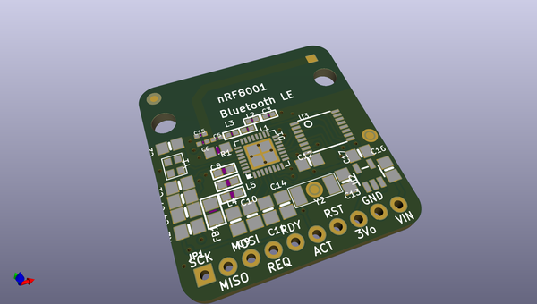
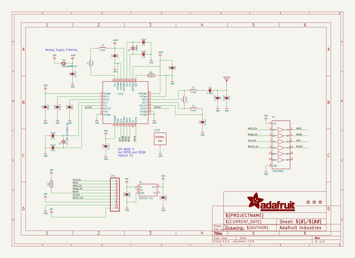
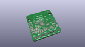
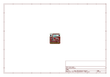
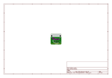
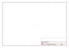
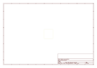
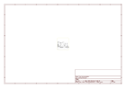
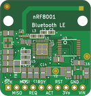

# OOMP Project  
## Adafruit-Bluefruit-LE-nRF8001-PCB  by adafruit  
  
(snippet of original readme)  
  
-- Bluefruit LE - Bluetooth Low Energy (BLE 4.0) - nRF8001 Breakout - v1.0 PCB  
<a href="http://www.adafruit.com/products/1697">   
Click here to purchase one from the Adafruit shop</a>  
  
Our Adafruit Bluefruit LE (Bluetooth Smart, Bluetooth Low Energy, Bluetooth 4.0) nRF8001 Breakout allows you to establish an easy to use wireless link between your Arduino and any compatible iOS or Android (4.3+) device. It works by simulating a UART device beneath the surface, sending ASCII data back and forth between the devices, letting you decide what data to send and what to do with it on either end of the connection.  
  
Unlike classic Bluetooth, BLE has no big contracts to sign and no major hoops that you have to jump through to create iOS peripherals that you can legally design and distribute in the App Store, which makes it a great choice compared to classic Bluetooth which had (and still has) a lot of restrictions around it on the iOS platform.  
  
These are the PCB files for Adafruit Bluefruit LE nRF8001 PCB. The format is EagleCAD schematic and board layout  
- https://www.adafruit.com/product/1697  
  
--- License  
  
Adafruit invests time and resources providing this open source design, please support Adafruit and open-source hardware by purchasing products from [Adafruit](https://www.adafruit.com)!  
  
All text above must be included in any redistribution  
  
Designed by Limor Fried/Ladyada for Adafruit Industries.  
Creative Commons Attribution/Sha  
  full source readme at [readme_src.md](readme_src.md)  
  
source repo at: [https://github.com/adafruit/Adafruit-Bluefruit-LE-nRF8001-PCB](https://github.com/adafruit/Adafruit-Bluefruit-LE-nRF8001-PCB)  
## Board  
  
  
## Schematic  
  
  
  
[schematic pdf](working_schematic.pdf)  
## Images  
  
  
  
  
  
  
  
  
  
  
  
  
  
  
  
  
  
  
