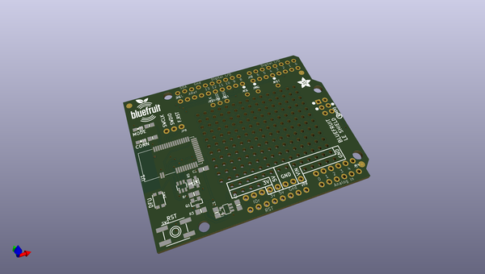
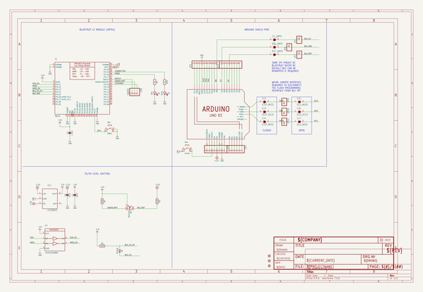
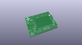
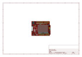
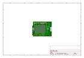
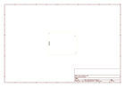
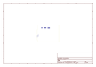
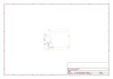

# OOMP Project  
## Adafruit-Bluefruit-LE-Shield-PCB  by adafruit  
  
oomp key: oomp_projects_flat_adafruit_adafruit_bluefruit_le_shield_pcb  
(snippet of original readme)  
  
-- Adafruit Bluefruit LE Shield PCB  
<a href="http://www.adafruit.com/products/2746">   
Click here to purchase one from the Adafruit shop</a>  
  
Would you like to add powerful and easy-to-use Bluetooth Low Energy to your robot, art or other electronics project? Heck yeah! With BLE now included in modern smart phones and tablets, its fun to add wireless connectivity. So what you really need is the new Adafruit Bluefruit LE Shield for Arduino!  
  
The Bluefruit LE Shield makes it easy to add Bluetooth Low Energy connectivity to your Arduino or compatible.  Solder in the included headers and plug right in. It connects to your Arduino or other microcontroller using the hardware SPI interface (MISO, MOSI, SCK) plus a chip select line (default D8), interrupt line (default D7) and reset (default D4). You can rearrange any and all the pins if you'd like, by cutting the jumpers underneath, and soldering jumper wires to your desired pins.  
  
PCB files for the Adafruit Bluefruit LE Shield. The format is EagleCAD schematic and board layout  
- https://www.adafruit.com/product/2746  
  
--- License  
  
Adafruit invests time and resources providing this open source design, please support Adafruit and open-source hardware by purchasing products from [Adafruit](https://www.adafruit.com)!  
  
All text above must be included in any redistribution  
  
Designed by Limor Fried/Ladyada for Adafruit Industries.  
Creative Commons Attribution/Share-Alike, all text above   
  full source readme at [readme_src.md](readme_src.md)  
  
source repo at: [https://github.com/adafruit/Adafruit-Bluefruit-LE-Shield-PCB](https://github.com/adafruit/Adafruit-Bluefruit-LE-Shield-PCB)  
## Board  
  
  
## Schematic  
  
  
  
[schematic pdf](working_schematic.pdf)  
## Images  
  
  
  
  
  
  
  
  
  
  
  
  
  
  
  
  
