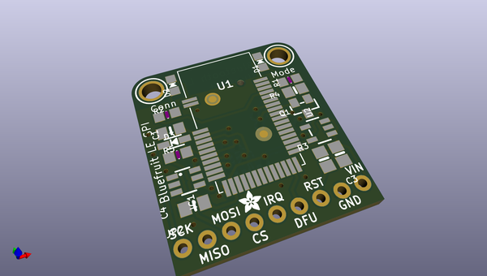
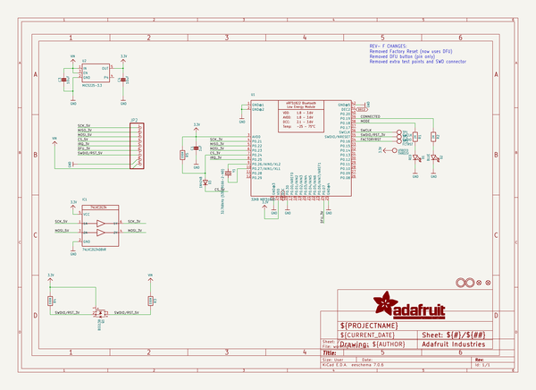
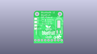
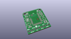
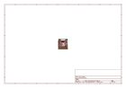
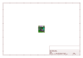
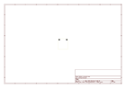
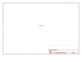
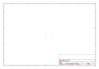
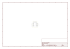

# OOMP Project  
## Adafruit-Bluefruit-LE-SPI-Friend-PCB  by adafruit  
  
oomp key: oomp_projects_flat_adafruit_adafruit_bluefruit_le_spi_friend_pcb  
(snippet of original readme)  
  
-- Adafruit Bluefruit LE SPI Friend PCB  
  
<a href="http://www.adafruit.com/products/2633">   
Click here to purchase one from the Adafruit shop</a>  
  
PCB files for the Adafruit Bluefruit LE SPI Friend PCB. Format is EagleCAD schematic and board layout  
* https://www.adafruit.com/product/2633  
  
--- Description  
  
The Bluefruit LE SPI Friend makes it easy to add Bluetooth Low Energy connectivity to anything with 4 or 5 GPIO pins. With SPI, you don't have to worry about baud rates, flow control, or giving up a hardware UART port. Connect to your Arduino or other microcontroller using the common four-pin SPI interface (MISO, MOSI, SCK and CS) plus a 5th GPIO pin for interrupts (to let the Arduino know when data or a response is ready).  
  
This multi-function module can do quite a lot! For most people, they'll be very happy to use the standard Nordic UART RX/TX connection profile. In this profile, the Bluefruit acts as a data pipe, that can 'transparently' transmit back and forth from your iOS or Android device. You can use our iOS App or Android App, or write your own to communicate with the UART service.  
  
--- License  
  
Adafruit invests time and resources providing this open source design, please support Adafruit and open-source hardware by purchasing products from [Adafruit](https://www.adafruit.com)!  
  
Designed by Limor Fried/Ladyada for Adafruit Industries.  
  
Creative Commons Attribution/Share-Alike, all text above must be included in   
  full source readme at [readme_src.md](readme_src.md)  
  
source repo at: [https://github.com/adafruit/Adafruit-Bluefruit-LE-SPI-Friend-PCB](https://github.com/adafruit/Adafruit-Bluefruit-LE-SPI-Friend-PCB)  
## Board  
  
  
## Schematic  
  
  
  
[schematic pdf](working_schematic.pdf)  
## Images  
  
  
  
  
  
  
  
  
  
  
  
  
  
  
  
  
