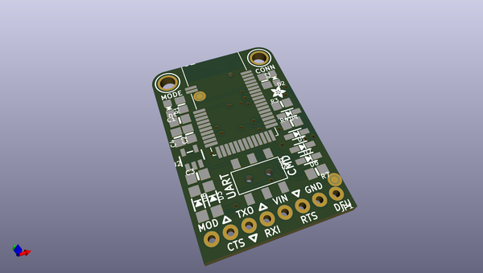
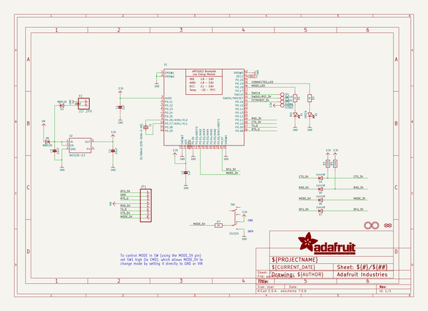
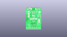
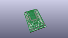
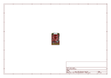
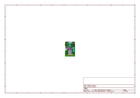
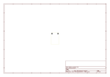
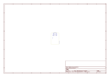
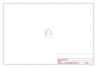

# OOMP Project  
## Adafruit-Bluefruit-LE-UART-Friend-PCB  by adafruit  
  
oomp key: oomp_projects_flat_adafruit_adafruit_bluefruit_le_uart_friend_pcb  
(snippet of original readme)  
  
- Adafruit Bluefruit LE UART Friend PCB  
<a href="http://www.adafruit.com/products/2479">   
Click here to purchase one from the Adafruit shop</a>  
  
The Bluefruit LE UART Friend makes it easy to add Bluetooth Low Energy connectivity to anything with a hardware or software serial port. We even have nice hardware flow control so you won't have to think about losing data. Connect to your Arduino or other microcontroller or even just a standard FTDI cable for debugging and testing.  
  
This multi-function module can do quite a lot! For most people, they'll be very happy to use the standard Nordic UART RX/TX connection profile. In this profile, the Bluefruit acts as a data pipe, that can 'transparently' transmit back and forth from your iOS or Android device. You can use our iOS App or Android App, or write your own to communicate with the UART service.  
  
PCB files for Adafruit Bluefruit LE UART Friend. Format is EagleCAD.   
- https://www.adafruit.com/product/2479  
  
--- License  
  
Adafruit invests time and resources providing this open source design, please support Adafruit and open-source hardware by purchasing products from [Adafruit](https://www.adafruit.com)!  
  
All text above must be included in any redistribution  
  
Designed by Limor Fried/Ladyada for Adafruit Industries.  
Creative Commons Attribution/Share-Alike, all text above must be included in any redistribution.   
See license.txt for additional information.  
  
  full source readme at [readme_src.md](readme_src.md)  
  
source repo at: [https://github.com/adafruit/Adafruit-Bluefruit-LE-UART-Friend-PCB](https://github.com/adafruit/Adafruit-Bluefruit-LE-UART-Friend-PCB)  
## Board  
  
  
## Schematic  
  
  
  
[schematic pdf](working_schematic.pdf)  
## Images  
  
  
  
  
  
  
  
  
  
  
  
  
  
  
  
  
