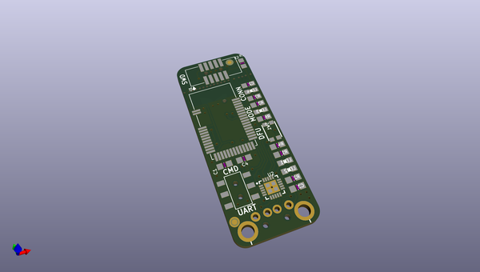
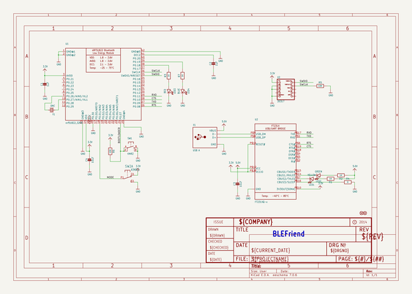
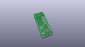
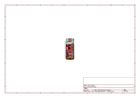
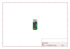
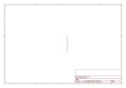
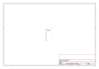
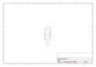

# OOMP Project  
## Adafruit-Bluefruit-LE-USB-Friend-and-Sniffer-PCB  by adafruit  
  
oomp key: oomp_projects_flat_adafruit_adafruit_bluefruit_le_usb_friend_and_sniffer_pcb  
(snippet of original readme)  
  
-- Adafruit Bluefruit LE USB Friend and Sniffer  
&nbsp;    
Click to purchase from the Adafruit Shop:  
- [Bluefruit LE Friend - Bluetooth Low Energy (BLE 4.0) - nRF51822 - v3.0](https://www.adafruit.com/product/2267)  
- [Bluefruit LE Sniffer - Bluetooth Low Energy (BLE 4.0) - nRF51822 - Firmware Version 2](https://www.adafruit.com/product/2269)  
  
The Bluefruit LE Friend is your new BLE BFF! This USB-to-BLE board makes it easy to get your computer talking to your BLE enabled phone or tablet using a standard serial/UART connection.  
  
In it's simplest form, it works on the same principle as a common USB/Serial adapter (the FTDI Friend, for example!). Any data that you enter via your favorite terminal emulator on your development machine will be transferred over the air to the connected phone or tablet, and vice versa, as a basic 'UART' connection.  
  
PCB files for the Bluefruit LE USB Friend and Sniffer  
- https://www.adafruit.com/product/2267  
- https://www.adafruit.com/product/2269  
  
--- License  
  
Adafruit invests time and resources providing this open source design, please support Adafruit and open-source hardware by [purchasing products from Adafruit](https://www.adafruit.com)!  
  
All text above must be included in any redistribution  
  
Designed by Limor Fried/Ladyada for Adafruit Indus  
  full source readme at [readme_src.md](readme_src.md)  
  
source repo at: [https://github.com/adafruit/Adafruit-Bluefruit-LE-USB-Friend-and-Sniffer-PCB](https://github.com/adafruit/Adafruit-Bluefruit-LE-USB-Friend-and-Sniffer-PCB)  
## Board  
  
  
## Schematic  
  
  
  
[schematic pdf](working_schematic.pdf)  
## Images  
  
  
  
  
  
  
  
  
  
  
  
  
  
  
  
  
