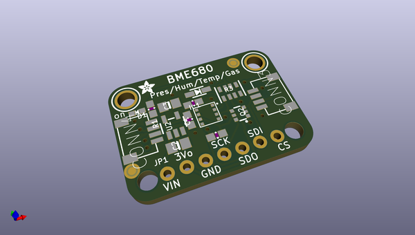
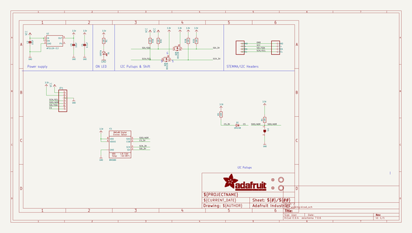
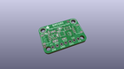
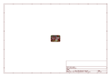
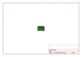
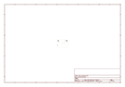
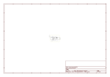
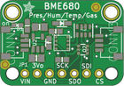

# OOMP Project  
## Adafruit-BME680-PCB  by adafruit  
  
(snippet of original readme)  
  
-- Adafruit BME680 PCB  
  
<a href="http://www.adafruit.com/products/3660">   
Click here to purchase one from the Adafruit shop</a>  
  
PCB files for the Adafruit BME680 Breakout. Format is EagleCAD schematic and board layout  
  
For more details, check out the product page at  
* https://www.adafruit.com/product/3660  
  
--- Description  
  
The long awaited BME680 from Bosch gives you all the environmental sensing you want in one small package. This little sensor contains temperature, humidity, barometric pressure, and VOC gas sensing capabilities. All over SPI or I2C at a great price!  
  
Like the BME280 & BMP280, this precision sensor from Bosch can measure humidity with ±3% accuracy, barometric pressure with ±1 hPa absolute accuracy, and temperature with ±1.0°C accuracy. Because pressure changes with altitude, and the pressure measurements are so good, you can also use it as an altimeter with  ±1 meter or better accuracy!  
  
The BME680 takes those sensors to the next step in that it contains a small MOX sensor. The heated metal oxide changes resistance based on the volatile organic compounds (VOC) in the air, so it can be used to detect gasses & alcohols such as Ethanol, Alcohol and Carbon Monoxide, and perform air quality measurements. Note it will give you one resistance value, with overall VOC content, but it cannot differentiate gasses or alcohols.  
  
Please note this sensor, like all VOC/gas sensors, has variability and to get precise me  
  full source readme at [readme_src.md](readme_src.md)  
  
source repo at: [https://github.com/adafruit/Adafruit-BME680-PCB](https://github.com/adafruit/Adafruit-BME680-PCB)  
## Board  
  
  
## Schematic  
  
  
  
[schematic pdf](working_schematic.pdf)  
## Images  
  
  
  
  
  
  
  
  
  
  
  
  
  
  
  
  
  
  
