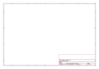

# OOMP Project  
## Adafruit-BMP085-PCB  by adafruit  
  
(snippet of original readme)  
  
- PCB for the Adafruit 5V ready BMP085 Barometric  
  
<a href="http://www.adafruit.com/products/391"> Click here to purchase one from the Adafruit shop</a>  
  
__Format is EagleCAD schematic and board layout__  
  
This precision sensor from Bosch is the best low-cost sensing solution for measuring barometric pressure and temperature. Because pressure changes with altitude you can also use it as an altimeter! The sensor is soldered onto a PCB with a 3.3V regulator, I2C level shifter and pull-up resistors on the I2C pins.  
  
__NEW! We now have a fully 5V compliant version of this board__ - a 3.3V regulator and a i2c level shifter circuit is included so you can use this sensor safely with 5V logic and power.  
  
Using the sensor is easy. For example, if you're using an Arduino, simply connect the VIN pin to the 5V voltage pin, GND to ground, SCL to I2C Clock (Analog 5) and SDA to I2C Data (Analog 4). Then download our [BMP085 Arduino library and example code for temperature, pressure and altitude calculation](https://github.com/adafruit/Adafruit-BMP085-Library). Install the library, and load the example sketch. Immediately you'll have precision temperature, pressure and altitude data. [We also have a detailed tutorial so you can understand the sensor in depth](http://learn.adafruit.com/bmp085) including how to properly calculate altitude based on sea-level barometric pressure  
  
-- License  
Adafruit invests time and resources providing this   
  full source readme at [readme_src.md](readme_src.md)  
  
source repo at: [https://github.com/adafruit/Adafruit-BMP085-PCB](https://github.com/adafruit/Adafruit-BMP085-PCB)  
## Board  
  
  
## Schematic  
  
  
  
[schematic pdf](working_schematic.pdf)  
## Images  
  
  
  
  
  
  
  
  
  
  
  
  
  
  
  
  
