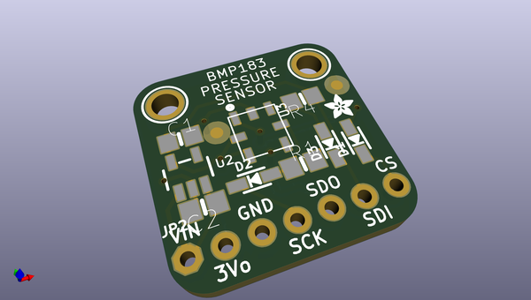
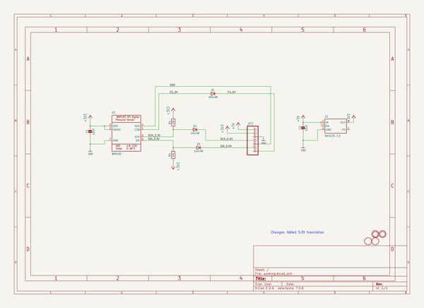
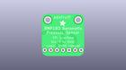
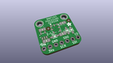
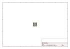
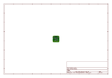
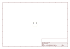
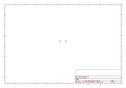
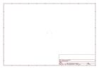
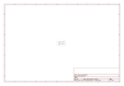

# OOMP Project  
## Adafruit-BMP183-Breakout-PCB  by adafruit  
  
oomp key: oomp_projects_flat_adafruit_adafruit_bmp183_breakout_pcb  
(snippet of original readme)  
  
-- Adafruit BMP183 Breakout PCB (Discontinued)  
<a href="http://www.adafruit.com/products/1900">   
Click here to view in the Adafruit shop</a>  
  
Fans of the BMP085/BMP180 will want to take a look at the new BMP183 - an SPI spin on the old familiar classic. This precision sensor from Bosch is the best low-cost sensing solution for measuring barometric pressure and temperature. Because pressure changes with altitude you can also use it as an altimeter!  
  
PCB files for the Adafruit BMP183 Breakout (discontinued). The format is EagleCAD schematic and board layout  
- https://www.adafruit.com/product/1900  
  
--- License  
  
Adafruit invests time and resources providing this open source design, please support Adafruit and open-source hardware by purchasing products from [Adafruit](https://www.adafruit.com)!  
  
All text above must be included in any redistribution  
  
Designed by Limor Fried/Ladyada for Adafruit Industries.  
Creative Commons Attribution/Share-Alike, all text above must be included in any redistribution.   
See license.txt for additional information.  
  
  full source readme at [readme_src.md](readme_src.md)  
  
source repo at: [https://github.com/adafruit/Adafruit-BMP183-Breakout-PCB](https://github.com/adafruit/Adafruit-BMP183-Breakout-PCB)  
## Board  
  
  
## Schematic  
  
  
  
[schematic pdf](working_schematic.pdf)  
## Images  
  
  
  
  
  
  
  
  
  
  
  
  
  
  
  
  
