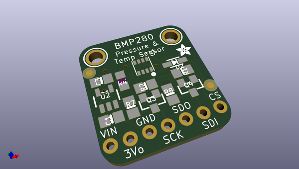
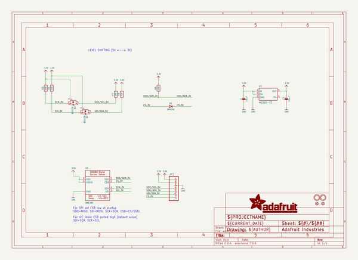
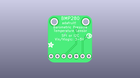
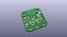
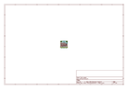
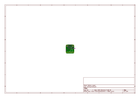
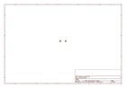
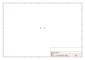
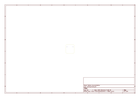
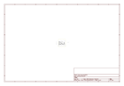

# OOMP Project  
## Adafruit-BMP280-Breakout-PCB  by adafruit  
  
(snippet of original readme)  
  
-- Adafruit BMP280 Breakout PCB  
  
<a href="http://www.adafruit.com/products/2651">   
Click here to purchase one from the Adafruit shop</a>  
  
PCB files for the Adafruit BMP280 Breakout. Format is EagleCAD schematic and board layout  
* https://www.adafruit.com/product/2651  
  
--- DESCRIPTION  
Bosch has stepped up their game with their new BMP280 sensor, an environmental sensor with temperature, barometric pressure that is the next generation upgrade to the BMP085/BMP180/BMP183. This sensor is great for all sorts of weather sensing and can even be used in both I2C and SPI!  
  
This precision sensor from Bosch is the best low-cost, precision sensing solution for measuring barometric pressure with ±1 hPa absolute accuraccy, and temperature with ±1.0°C accuracy. Because pressure changes with altitude, and the pressure measurements are so good, you can also use it as an altimeter with  ±1 meter accuracy.  
  
The BMP280 is the next-generation of sensors from Bosch, and is the upgrade to the BMP085/BMP180/BMP183 - with a low altitude noise of 0.25m and the same fast conversion time. It has the same specifications, but can use either I2C orSPI. For simple easy wiring, go with I2C. If you want to connect a bunch of sensors without worrying about I2C address collisions, go with SPI.  
  
Nice sensor right? So we made it easy for you to get right into your next project. The surface-mount sensor is soldered onto a PCB and comes with a 3.3V regulator and  
  full source readme at [readme_src.md](readme_src.md)  
  
source repo at: [https://github.com/adafruit/Adafruit-BMP280-Breakout-PCB](https://github.com/adafruit/Adafruit-BMP280-Breakout-PCB)  
## Board  
  
  
## Schematic  
  
  
  
[schematic pdf](working_schematic.pdf)  
## Images  
  
  
  
  
  
  
  
  
  
  
  
  
  
  
  
  
